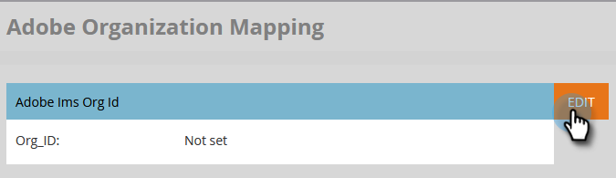
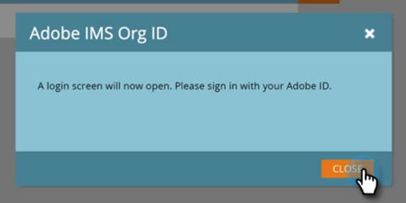

# 設定 Adobe 組織對應 {#set-up-adobe-organization-mapping}

若要與Adobe應用程式（例如Audience Manager、B2B CDP Marketo聯結器、[!DNL Dynamic Chat]等）同步，您必須先在Marketo Engage中輸入Adobe IMS組織認證。

>[!NOTE]
>
>* Marketo執行個體的HIPAA就緒部署無法使用此整合。
>* 為了讓整合發揮作用，Marketo和您的其他Adobe應用程式必須位於相同組織。

>[!IMPORTANT]
>
>對於已上線至Adobe Business Platform和Identity Management系統的使用者，系統將會填入與訂閱相關聯的組織ID，且為唯讀欄位。 因此，本文中的步驟不適用。

1. 在Marketo中，按一下&#x200B;**[!UICONTROL Admin]**。

   

1. 在整合下，按一下&#x200B;**[!UICONTROL Adobe Organization Mapping]**。

   

1. 按一下「**[!UICONTROL Edit]**」。

   

1. 輸入您的[Adobe IMS組織ID](https://experienceleague.adobe.com/docs/control-panel/using/faq.html){target="_blank"})，然後按一下&#x200B;**[!UICONTROL OK]**。

   

1. 按一下「**[!UICONTROL Confirm]**」。

   

1. 按一下「**[!UICONTROL Close]**」。

   

   >[!IMPORTANT]
   >
   >基於安全考量，您必須是您要對應至之Adobe組織的組織管理員。 否則，動作將失敗。 此外，Adobe使用者和Marketo使用者在登入時必須使用相同的電子郵件地址。

1. 如果您&#x200B;_尚未_&#x200B;登入，新索引標籤或視窗中將會顯示快顯視窗。 登入您的Adobe組織（此動作會驗證組織存取權）。

您現在可以[與共用對象資料](/help/marketo/product-docs/core-marketo-concepts/smart-lists-and-static-lists/static-lists/send-a-list-to-adobe-experience-cloud.md){target="_blank"}，或從Adobe Experience Cloud同步對象[&#128279;](/help/marketo/product-docs/adobe-experience-cloud-integrations/sync-an-audience-from-adobe-experience-cloud.md){target="_blank"}。
