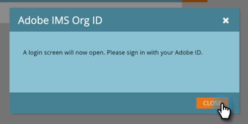

# 設定Adobe組織對應 {#set-up-adobe-organization-mapping}

若要與Adobe應用程式(例如Audience Manager、B2B CDP Marketo連接器、Dynamic Chat等)同步，您必須先在Marketo中輸入您的Adobe IMS組織憑證。

>[!NOTE]
>
>Marketo實例的HIPAA就緒部署無法使用此整合。

>[!CAUTION]
>
>對於已上線至Adobe業務平台和Identity Management系統的客戶，與訂閱相關聯的組織ID將會填入，且為唯讀欄位。

1. 在Marketo中，按一下 **管理**.

   

1. 在整合下方，按一下 **Adobe組織對應**.

   

1. 按一下 **編輯**.

   

1. 輸入您的Adobe IMS組織ID(了解如何尋找 [此處](https://experienceleague.adobe.com/docs/control-panel/using/faq.html))，然後按一下 **確定**.

   

1. 按一下 **確認**.

   

1. 按一下 **關閉**.

   

   >[!IMPORTANT]
   >
   >基於安全考量，您必須是要對應之Adobe組織的組織管理員。 若非如此，動作將會失敗。 此外，Adobe使用者和Marketo使用者在登入時必須使用相同的電子郵件地址。

1. 如果你 _not_ 已登入，新索引標籤/視窗中會出現快顯視窗。 登入您的Adobe組織（此動作會驗證組織存取權）。

就這樣！ 您現在可以 [共用受眾資料](/help/marketo/product-docs/core-marketo-concepts/smart-lists-and-static-lists/static-lists/send-a-list-to-adobe-experience-cloud.md){target=&quot;_blank&quot;}設為或 [同步對象](/help/marketo/product-docs/adobe-experience-cloud-integrations/sync-an-audience-from-adobe-experience-cloud.md)來自Adobe Experience Cloud的{target=&quot;_blank&quot;}。
