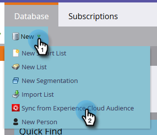
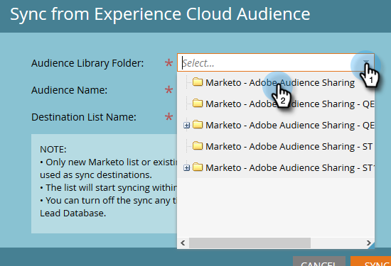

# 從 Adobe Experience Cloud 同步客群 {#sync-an-audience-from-adobe-experience-cloud}

>[!NOTE]
>
>Marketo執行個體的HIPAA就緒部署無法使用此整合。

>[!PREREQUISITES]
>
>[設定Adobe組織對應](/help/marketo/product-docs/adobe-experience-cloud-integrations/set-up-adobe-organization-mapping.md){target="_blank"}

## 如何同步受眾 {#how-to-sync-an-audience}

1. 在「我的Marketo」中，按一下「**[!UICONTROL Database]**」圖磚。

   

1. 按一下「**[!UICONTROL New]**」下拉式選單，選取「**[!UICONTROL Sync from Experience Cloud Audience]**」。

   

1. 按一下&#x200B;**[!UICONTROL Audience Library Folder]**&#x200B;下拉式清單，然後選取所需的原始資料夾。

   

1. 選取&#x200B;**[!UICONTROL Audience Name]**。

   

1. 您可以針對目的地選取現有清單，或輸入新清單的名稱。 在此範例中，正在建立新清單。 完成後請按一下 **[!UICONTROL Sync]**。

   

1. 按一下「**[!UICONTROL OK]**」。

   

## 常見問題集 {#faq}

**Cookie同步如何運作？**

為您的Marketo訂閱啟用Cookie同步後，Marketo的munchkin.js會嘗試針對您在整合設定期間指定的Adobe IMS組織擷取和儲存Adobe ECID，並將這些ECID比對至對應的Marketo Cookie識別碼。 這可讓Marketo的匿名使用者設定檔更加豐富Adobe ECID。

還需要進一步步驟，將匿名使用者設定檔與潛在客戶設定檔建立關聯（使用純文字電子郵件識別）。 [在此說明](/help/marketo/product-docs/reporting/basic-reporting/report-activity/tracking-anonymous-activity-and-people.md){target="_blank"}的運作方式。

**為什麼Marketo中的清單大小與Adobe中的清單大小不同？**

如果ECID Cookie ID無法繫結至Marketo中的已知人員，則人員也不會進行同步處理。

**這是一次性同步嗎？**

您只需要起始同步處理一次。 之後，記錄會自動同步。 初始同步最多可能需要24小時；以後，新記錄將在2-3小時內同步。
