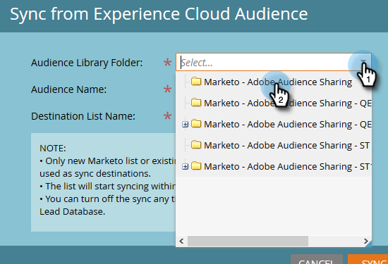

# 從Adobe Experience Cloud同步受眾 {#sync-an-audience-from-adobe-experience-cloud}

>[!NOTE]
>
>Marketo實例的HIPAA就緒部署無法使用此整合。

>[!PREREQUISITES]
>
>[設定Adobe組織對應](/help/marketo/product-docs/adobe-experience-cloud-integrations/set-up-adobe-organization-mapping.md){target=&quot;_blank&quot;}

## 如何同步受眾 {#how-to-sync-an-audience}

1. 在「我的Marketo」中，按一下 **資料庫** 方塊。

   

1. 按一下 **新增** 下拉式清單並選取 **從Experience Cloud對象同步**.

   

1. 按一下 **對象庫資料夾** 下拉式清單，然後選取所需的來源資料夾。

   

1. 選取 **對象名稱**.

   

1. 對於目標，您可以選取現有清單，或輸入新清單的名稱。 在此範例中，我們要建立新的。 按一下 **同步** 時才能使用。

   

1. 按一下 **確定**.

   

## 常見問題集 {#faq}

**Cookie同步如何運作？**

當您的Marketo訂閱啟用Cookie同步時，Marketo的munchkin.js會嘗試在整合設定期間為您指定的Adobe IMS組織擷取並儲存AdobeECID，並將這些ECID與對應的Marketo Cookie識別碼相符。 這可讓Marketo的匿名使用者設定檔更加豐富AdobeECID。

還需要執行進一步步驟來將匿名用戶配置檔案與銷售機會配置檔案關聯，銷售機會配置檔案是使用純文字電子郵件標識的。 其運作方式 [此處說明](/help/marketo/product-docs/reporting/basic-reporting/report-activity/tracking-anonymous-activity-and-people.md){target=&quot;_blank&quot;}。

**Marketo中的清單大小為何與Adobe中的不同？**

如果我們無法將ECID Cookie ID系結至Marketo中的已知人員，系統也不會同步該人員。

**這是一次性同步嗎？**

您只需啟動一次同步。 之後，記錄會自動同步。 初始同步最多需要24小時；今後，新記錄將在2到3小時內同步。
