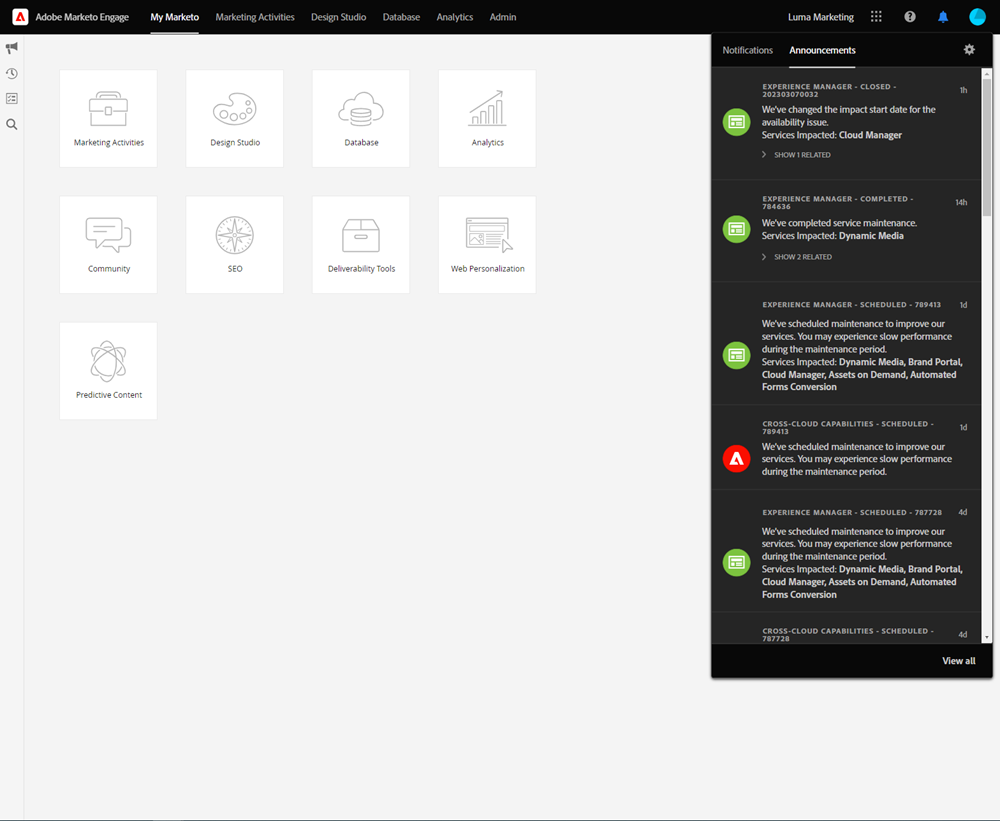

# 統一殼層概述 {#unified-shell-overview}

Unified Shell會協調Adobe Experience Cloud應用程式和服務的「殼層」外觀。 但是，這不只是新設計。 這是單頁應用程式，可在單一執行個體中提供使用者體驗。

## 使用者流量 {#user-flow}

**統一的殼流**

如果您已登入Adobe Experience Cloud產品，請按一下功能表圖示並選取 **[!DNL Marketo Measure]**.

>[!NOTE]
>
>您的下拉式功能表可能會根據您訂閱的Adobe Experience Cloud產品而有所不同。

如果你 _not_ 已登入Adobe Experience Cloud產品，請直接登入 [!DNL Marketo Engage] 此處： [https://experience.adobe.com/marketo-engage](https://experience.adobe.com/marketo-engage).

## 新功能 {#new-features}

除了更新的外觀和風格外，您還會注意到下列功能：

**網域管理**

[管理 [!DNL Marketo Engage] 網域](/help/marketo/product-docs/administration/email-setup/add-multiple-branding-domains/add-an-additional-branding-domain.md) 沒有協助 [!DNL Marketo Engage].

PIC2

**整合式說明中心**

搜尋支援文章、提交票證、提供意見反應，全部來自 [!DNL Marketo Engage] 應用程式。

**應用程式切換器**

那些可存取多種Adobe產品的使用者，將可輕鬆切換。

PIC4

**通知與公告**

直接在應用程式中檢視產品特定通知和一般Adobe產品公告，並與之互動。

**Adobe設定**

按一下您的設定檔圖示以變更您的語言或其他Adobe範圍的偏好設定。 您也可以 [!DNL Marketo Engage]按一下 **我的設定**.

## 常見問題集 {#faq}

**無法登錄 [!DNL Marketo Engage] 通過統一殼層。 問題可能是什麼？**

如果您可以登入Adobe Experience Cloud，但看到的頁面如下，則問題可能出在 [!DNL Marketo Engage] 側：

PIC7

如果您收到上述錯誤，請 [聯絡支援](https://nation.marketo.com/t5/support/ct-p/Support) 以求協助。

《史蒂芬的筆記》

您可透過Experience Cloud/IMS登入。

您需透過「Marketo啟動頁面」存取Marketo執行個體，該頁面會為使用者在其組織中可存取的每個Marketo執行個體顯示一個圖磚。 接著，按一下圖磚，即可啟動Marketo。

使用者歷史記錄、全域搜尋、Marketo通知和任務匣從上方列移至左側的新列

我Marketo的歷史樹要走了

無書籤
