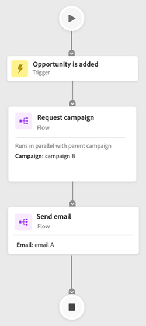

# 參與地圖示籤 {#engagement-map-tab}

參與地圖會透過一系列觸發器、篩選器和流量卡來表示。 按一下每個卡片就會顯示其他資訊。

觸發器概覽：此卡片顯示促銷活動中的觸發器數量。 按一下卡片就會顯示每個觸發器的卡片，以及提供下列資訊的滑出面板：

* 觸發器所屬的行銷活動
* 觸發器名稱清單
* 「編輯觸發器」按鈕

  

觸發器詳細資料：此卡片顯示觸發器名稱。 按一下滑出畫面會顯示包含下列資訊的滑出面板：

* 觸發器所屬的行銷活動
* 與觸發程式關聯的限制清單
* 「編輯觸發器」按鈕

  

篩選：按一下此卡片將顯示一個包含下列資訊的滑出面板：

* 觸發器所屬的行銷活動
* 符合篩選條件的預估人數
* 篩選器清單及其個別限制
* 「編輯篩選器」按鈕

  

流程步驟：如果流程步驟包含選項，此卡片會顯示流程步驟的名稱。 按一下滑出畫面會顯示包含下列資訊的滑出面板：

* 流量步驟所屬的行銷活動
* 與流程步驟關聯的選擇條件清單
* 「編輯流量」按鈕

  

流程步驟：如果流程步驟有 _非_ 包含任何選項，此卡片將顯示與流程步驟相關聯的屬性。 按一下滑出畫面會顯示包含下列資訊的滑出面板：

* 流量步驟所屬的行銷活動
* 與流程步驟相關聯的屬性清單
* 「編輯流量」按鈕

  

## 執行和請求行銷活動的流程步驟 {#flow-step-for-execute-and-request-campaigns}

* 如果「執行」或「請求促銷活動」流程步驟不含任何選項，資訊卡會顯示促銷活動名稱。 按一下卡片會顯示一個包含下列資訊的滑出面板：

   * 流程步驟所屬的行銷活動
   * 「編輯流量」按鈕
   * 與流程步驟相關聯的屬性清單
   * 「檢視清單」按鈕可開啟使用特定請求/執行行銷活動的行銷活動清單

>[!NOTE]
>
>您可以從主要行銷活動中編輯流程步驟。 若要編輯巢狀行銷活動，您必須透過滑出面板中的連結導覽至行銷活動。

* 如果「執行」或「請求促銷活動」流程步驟包含選項，卡片將顯示促銷活動名稱。 按一下卡片會顯示一個包含下列資訊的滑出面板：

   * 流程步驟所屬的行銷活動
   * 與流程步驟關聯的選擇條件清單
   * 「編輯流量」按鈕

  

  

* 如果「執行」或「請求促銷活動」包含選項，則按一下流量卡片即會展開，以顯示個別卡片中的所有選項。 按一下選擇卡片會展開與特定選擇相關聯的促銷活動，並顯示包含下列資訊的滑出面板：

   * 選擇所屬的行銷活動
   * 「編輯選擇」按鈕
   * 與流程步驟關聯的選擇條件清單
   * 「檢視清單」按鈕可開啟使用特定請求/執行行銷活動的行銷活動清單

  

## 將巢狀執行行銷活動視覺化 {#visualizing-a-nested-execute-campaign}

執行與父行銷活動連續執行的行銷活動。 符合可執行行銷活動資格的人會完成行銷活動的所有流程步驟，然後返回主要行銷活動，以繼續完成此行銷活動的流程步驟。

以下是智慧行銷活動「行銷活動A」的範例，其中包括執行行銷活動流程步驟。 請將「促銷活動A」視為您的主要促銷活動。

1. 按一下執行行銷活動流量卡片將會展開，以顯示「行銷活動B」的詳細資訊。
1. 「促銷活動B」包含篩選器，可將受眾分割成兩個群組：合格和未合格。
1. 合格對象會完成與「促銷活動B」相關的流程步驟。
1. 所有對象（合格且非合格）會回到「行銷活動A」並繼續進行下一個流程步驟。

   

您可以按一下「促銷活動B」中的「執行促銷活動」流程步驟，此步驟將展開以顯示與每個選擇相關聯的選擇卡和促銷活動。

## 將請求行銷活動視覺化 {#visualizing-request-campaign}

請求行銷活動與父行銷活動平行執行。 符合請求行銷活動資格的人完成行銷活動的所有流程步驟，然後退出行銷活動。 同時，同一組人員會完成主要行銷活動的流量步驟。

以下是智慧行銷活動「行銷活動A」的範例，其中包括請求行銷活動流程步驟。 請將「促銷活動A」視為您的主要促銷活動。

1. 按一下請求行銷活動流量卡片將會展開，以顯示「行銷活動B」的詳細資料
1. 「促銷活動B」包含篩選器，可將受眾分割成兩個群組：合格和未合格。
1. 合格對象會完成與「促銷活動B」相關的流程步驟。
1. 同時，所有對象會移至「促銷活動A」中的下一個流程步驟。

   

如果任何流量步驟包含其他請求行銷活動，您可以按一下流量卡片來檢視行銷活動的詳細資訊，以深入瞭解巢狀行銷活動。

以下是包含選擇的請求行銷活動的範例。

## 錯誤處理 {#error-handling}

智慧列示和流程步驟中的錯誤會透過卡片中的錯誤圖示強調顯示。 此外，對應的錯誤訊息將會反映在滑出面板中。

以下是觸發程式中的錯誤範例，此錯誤會顯示在觸發程式概述卡片、滑出面板和詳細資料觸發程式卡片中。

**篩選器卡片中的錯誤可能包括：**

* 智慧清單中發生錯誤，導致未顯示合格對象

* 篩選器邏輯發生錯誤

* 一或多個篩選器中的限制（或缺少限制）發生錯誤

  

不輸入值（屬性）不會造成錯誤，但會繼續如在「流量」標籤中般運作。 因此，現有的行銷活動不會被中斷。 但是，當流程步驟不包含任何屬性時，這些屬性會顯示為警告。

如^^^我們真的需要此專案，客戶不會看到警告???

>[!NOTE]
>
>在您按一下以展開巢狀行銷活動之前，巢狀行銷活動中的錯誤不會顯示。
