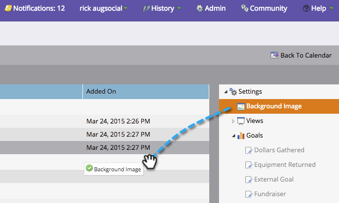

# 新增背景影像至簡報 {#add-a-background-image-to-a-presentation}

選取背景影像以自訂簡報。

>[!PREREQUISITES]
>
>* [建立簡報](create-a-presentation.md)

>

1. 按一下右鍵演示，然後選擇「查看 **設定」**。

   >[!NOTE]
   >
   >您也可以按兩下簡報，以輸入設定標籤。

   

1. 從右側樹狀結構拖放**背景影像**至畫布。

   

1. 從影像庫中選取影像。

   >[!TIP]
   >
   >為獲得最清晰的外觀，請使用 **1920 x 1080** 或 **1280 x 720的影像**。

   

1. 按一 **下「預覽** 」以將其勾出。

   

   就這樣！

