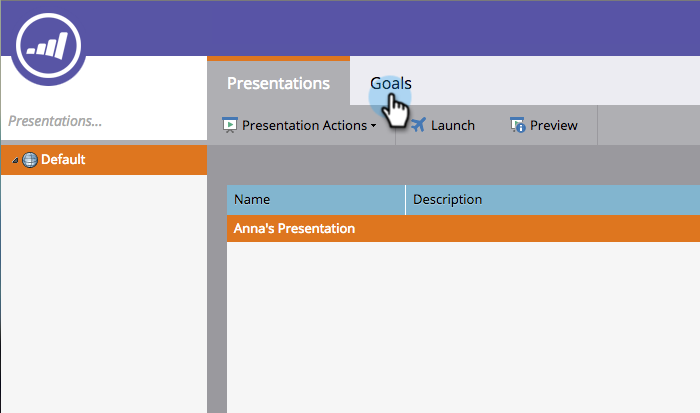

# 建立自訂目標 {#create-a-custom-goal}

目標是追蹤進度並激勵您團隊的方式。 建立後，必須手動更新。

就像演示一樣，目標是 [工作區](/help/marketo/product-docs/administration/workspaces-and-person-partitions/understanding-workspaces-and-person-partitions.md) — 特定。

1. 前往 **日曆**.

   

1. 按一下 **簡報** 在右下角。

   

1. 選取 **目標** 標籤。

   

1. 拖放 **自訂目標** 進入畫布。

   

1. 輸入目標的名稱。 選取 **貨幣**.

   >[!NOTE]
   >
   >如果目標不是可供選取的貨幣值 **無**.

   

1. 輸入 **目標目標** 和 **目前值** (如果沒有， **輸入0**)。 然後按一下 **建立**.

   

   您的自訂目標已建立！

   
