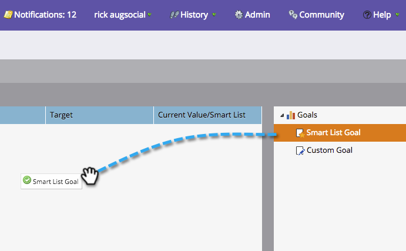

# 建立智慧清單目標 {#create-a-smart-list-goal}

目標是追蹤進度並激勵團隊的方式。 它們可與智慧型清單結合，以追蹤Marketo中的各種事物。 此外，在您設定好智慧型清單目標後，當它用於簡報時，每2小時就會自動更新一次。

和簡報一樣，目標也 [是工作](../../../../product-docs/administration/workspaces-and-person-partitions/understanding-workspaces-and-person-partitions.md)區專屬的。

1. 前往日 **歷**。

   

1. 按一 **下右下** 角的「簡報」。

   

1. 選擇**目標**頁籤。

   

1. 將智慧型清 **單目標拖放** 至畫布上。

   

1. 輸入目標名稱並輸入目標 **目標**。 然後按一下 **建立**。

   

1. [定義智慧清單](../../../../product-docs/core-marketo-concepts/smart-lists-and-static-lists/creating-a-smart-list/find-and-add-filters-to-a-smart-list.md)。 無限可能！

   

1. 在全部設定好智慧清單後，按一下「 **Close** （關閉）」按鈕，返回上一個頁籤。

   

   看！ 您的智慧清單目標已建立。

   

