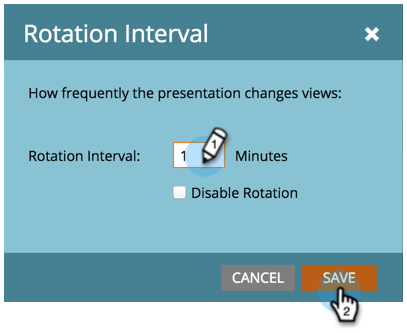

# 自訂簡報 {#customize-a-presentation}

設定您的行事曆簡報，以反映對您的團隊最重要的目標和活動。

>[!AVAILABILITY]
>
>
>並非所有客戶都已購買此功能。 請聯絡您的銷售代表以取得詳細資訊。

>[!PREREQUISITES]
>
>* [建立自訂目標](/help/marketo/product-docs/core-marketo-concepts/marketing-calendar/calendar-hd/create-a-custom-goal.md){target="_blank"} or [Smart List Goals](/help/marketo/product-docs/core-marketo-concepts/marketing-calendar/calendar-hd/create-a-smart-list-goal.md){target="_blank"}
>
>* [建立簡報](/help/marketo/product-docs/core-marketo-concepts/marketing-calendar/calendar-hd/create-a-presentation.md){target="_blank"}

## 選擇檢視 {#choosing-the-views}

Presentations循環使用不同的 [篩選器定義](/help/marketo/product-docs/core-marketo-concepts/marketing-calendar/working-with-the-calendar/filtering-the-marketing-calendar.md){target="_blank"} 您選擇。 請視需要儘量提取檢視次數，並自訂頻率。

1. 從右邊的樹狀結構中，拖曳您要在簡報中旋轉的不同檢視。

   

## 新增目標 {#add-a-goal}

Presentations是顯示團隊目標時最棒的。 只要拖曳到不同的位置 [自訂目標](/help/marketo/product-docs/core-marketo-concepts/marketing-calendar/calendar-hd/create-a-custom-goal.md){target="_blank"} or [smart list goals](/help/marketo/product-docs/core-marketo-concepts/marketing-calendar/calendar-hd/create-a-smart-list-goal.md){target="_blank"}. 您最多可以使用10個。

1. 從右邊的樹狀結構中，拖曳您要在簡報中顯示的不同目標。

   

## 設定旋轉頻率 {#set-the-frequency-of-rotation}

一旦您將您要的檢視拉入簡報中，請設定它在不同檢視之間旋轉的頻率。

1. 按一下 **[!UICONTROL 5分鐘]** （這是預設步調）。

   

1. 以分鐘輸入時間。 按一下 **[!UICONTROL 儲存]**.

   >[!NOTE]
   >
   >透過核取顯示一個靜態檢視 **[!UICONTROL 停用旋轉]**.

   

## 設定行事曆顯示 {#set-the-calendar-display}

行事曆顯示可以變更為3週或每月檢視。

1. 選取 **[!UICONTROL 行事曆顯示]** 下拉式清單，然後選擇 **[!UICONTROL 3週]** 或一個 **[!UICONTROL 月]**.

   

   棒極了！ 準備好觀看您的簡報了嗎？

>[!TIP]
>
>設定 [背景影像](/help/marketo/product-docs/core-marketo-concepts/marketing-calendar/calendar-hd/add-a-background-image-to-a-presentation.md){target="_blank"} 您的簡報。 我們建議使用小貓或彩虹。

## 預覽簡報 {#preview-a-presentation}

設定簡報後，即可預覽和啟動。

1. 選取 **[!UICONTROL 預覽]**.

   

   太棒了！ 這是簡報的外觀。

   

   不喜歡您看到的內容？ 返回並使用不同的篩選器定義來建立您喜歡的檢視。

>[!MORELIKETHIS]
>
>* [新增背景影像至簡報](/help/marketo/product-docs/core-marketo-concepts/marketing-calendar/calendar-hd/add-a-background-image-to-a-presentation.md){target="_blank"}
>* [啟動簡報](/help/marketo/product-docs/core-marketo-concepts/marketing-calendar/calendar-hd/launch-a-presentation.md){target="_blank"}
