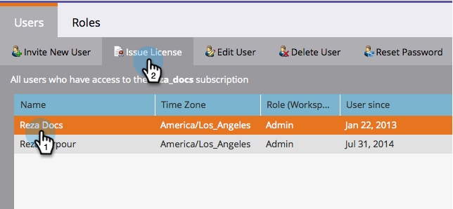

# 發行/撤銷行銷行事曆授權 {#issue-revoke-a-marketing-calendar-license}

>[!NOTE]
>
>**需要管理員許可權**

若要使用您的[行銷行事曆](/help/marketo/product-docs/core-marketo-concepts/marketing-calendar/understanding-the-calendar/navigating-the-marketing-calendar.md){target="_blank"}名額，您必須向需要存取許可權的使用者發行授權。 方法如下。

1. 移至&#x200B;**[!UICONTROL Admin]**&#x200B;區段。

   

1. 按一下「**[!UICONTROL Users & Roles]**」。

   

1. 選取使用者並按一下&#x200B;**[!UICONTROL Issue License]**。

   >[!TIP]
   >
   >使用&#x200B;**Ctrl/Cmd+按一下**&#x200B;一次選取多個使用者。

   

1. 檢查&#x200B;**[!UICONTROL Enable License]**&#x200B;並按一下&#x200B;**[!UICONTROL Save]**。

   >[!NOTE]
   >
   >授權數量限製為5個。 如果您需要更多資訊，請聯絡您的銷售代表。

   

   做得很好！ 在&#39;[!UICONTROL Calendar]？&#39;下看到綠色核取記號

   
