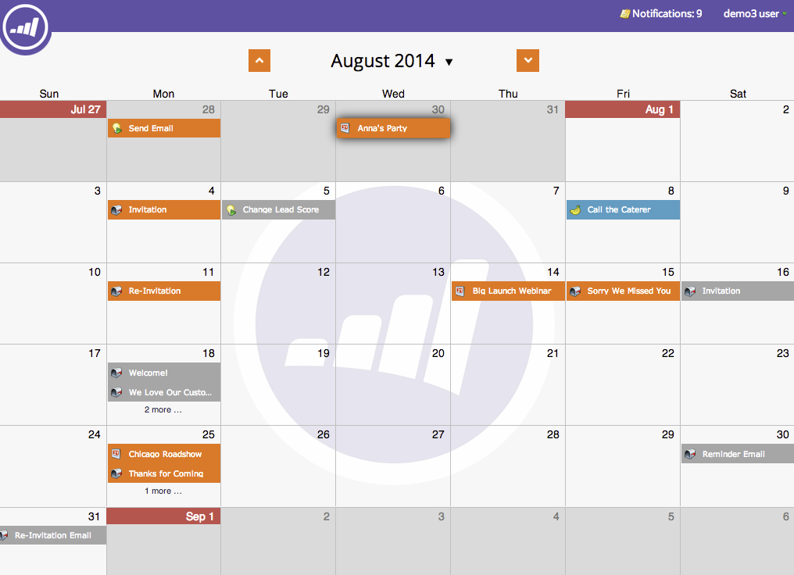
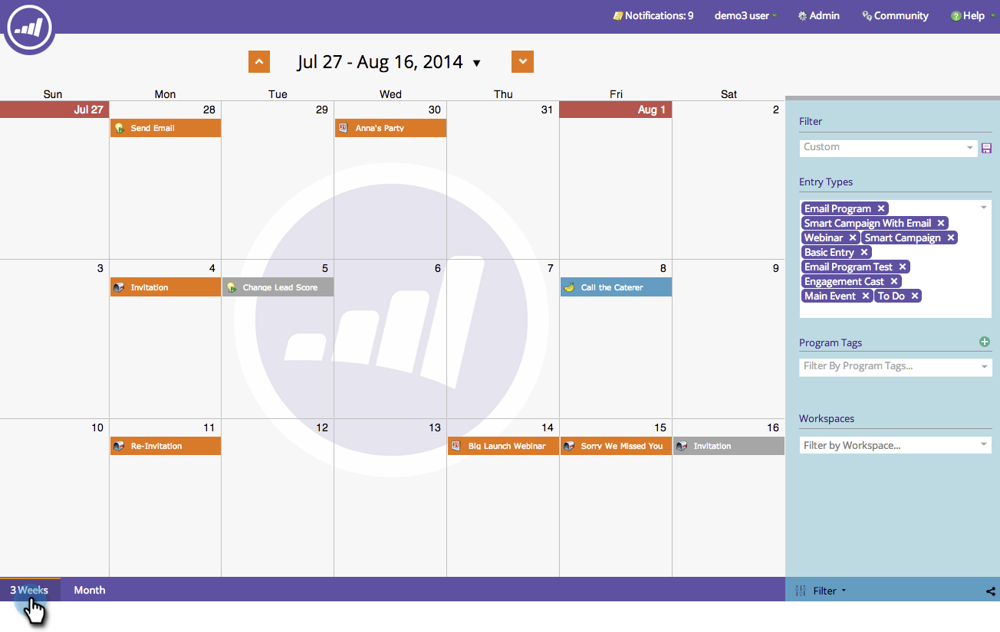

# 瀏覽行銷行事曆 {#navigating-the-marketing-calendar}

瀏覽行銷行事曆就像一、二、三一樣容易！

>[!PREREQUISITES]
>
>確定您擁有 [行銷行事曆授權](/help/marketo/product-docs/core-marketo-concepts/marketing-calendar/understanding-the-calendar/issue-revoke-a-marketing-calendar-license.md){target="_blank"}  — 否則，「行銷行事曆」動態磚將不會顯示在「我的Marketo」中。

1. 前往 **行銷行事曆**.

   

1. 這是在Marketo執行個體中排程的資產的鳥瞰圖。

   

## 在模式之間變更 {#change-between-modes}

1. 按一下 **[!UICONTROL 3週]** 或 **[!UICONTROL 月]** 標籤來切換模式。

   

## 使用議程檢視 {#use-the-agenda-view}

議程檢視會將您所有的專案顯示為清單。

1. 按一下 **[!UICONTROL 篩選]** 下拉式清單。

   

1. 選取 **[!UICONTROL 議程]** 檢視。

   

   太棒了！ 這個檢視畫面很適合用來檢視所有已規劃專案。

   

## 瀏覽時間 {#navigate-through-time}

沒有德羅蘭！ 只需按一下導覽按鈕。

您也可以使用這些鍵盤快速鍵。

| 動作 | 鍵盤快速鍵 |
|---|---|
| 回到時間 | alt/opt + up |
| 準時轉寄 | alt/opt +向下 |
| 前往「今天」 | alt/opt + t |

太棒了！ 這些是基本知識。 您也可以使用篩選器自訂檢視。

>[!MORELIKETHIS]
>
>[篩選行銷行事曆](/help/marketo/product-docs/core-marketo-concepts/marketing-calendar/working-with-the-calendar/filtering-the-marketing-calendar.md){target="_blank"}
