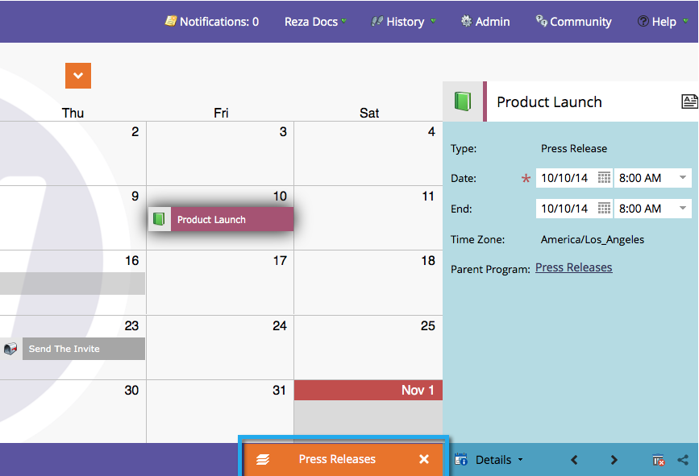

# 了解/啟用計畫重點 {#understand-enable-program-focus}

行銷行事歷可提供物品的鳥瞰檢視，但也允許進行一些互動。 您可以 [建立](/help/marketo/product-docs/core-marketo-concepts/marketing-calendar/working-with-the-calendar/create-entries-directly-in-the-marketing-calendar.md), [編輯](/help/marketo/product-docs/core-marketo-concepts/marketing-calendar/working-with-the-calendar/edit-entries-directly-in-the-marketing-calendar.md), [刪除](/help/marketo/product-docs/core-marketo-concepts/marketing-calendar/working-with-the-calendar/delete-entries-directly-in-the-marketing-calendar.md)，和 [確認](/help/marketo/product-docs/core-marketo-concepts/marketing-calendar/working-with-the-calendar/confirm-entries-directly-in-the-marketing-calendar.md) 條目。 若要與參加項目互動，您必須先專注於方案。

1. 前往 **行銷行事歷**.

   

1. 選取項目並按一下 **顯示節目焦點**.

   

1. 請注意，我們現在的重點是名為「新聞發佈」的計畫。

   

   >[!NOTE]
   >
   >將焦點放在程式上，可讓您只與屬於該程式的項目互動，並建立將由其儲存的新項目。

1. 完成後，請放開重點，以與其他計畫/項目互動。

   

太棒了！ 接下來，學習如何與參加項目互動。

>[!MORELIKETHIS]
>
>* [直接在行銷日曆中建立登入點](/help/marketo/product-docs/core-marketo-concepts/marketing-calendar/working-with-the-calendar/create-entries-directly-in-the-marketing-calendar.md)
>* [直接在行銷日曆中編輯登入點](/help/marketo/product-docs/core-marketo-concepts/marketing-calendar/working-with-the-calendar/edit-entries-directly-in-the-marketing-calendar.md)
>* [直接在行銷日曆中刪除項目](/help/marketo/product-docs/core-marketo-concepts/marketing-calendar/working-with-the-calendar/delete-entries-directly-in-the-marketing-calendar.md)
>* [直接在行銷日曆中確認登入](/help/marketo/product-docs/core-marketo-concepts/marketing-calendar/working-with-the-calendar/confirm-entries-directly-in-the-marketing-calendar.md)

