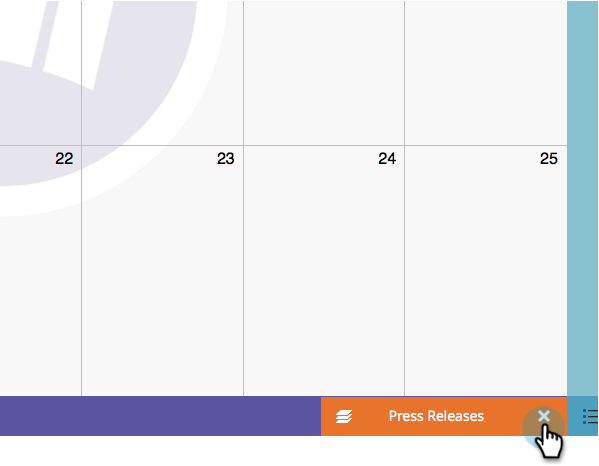

# 直接在行銷行事曆中建立專案 {#create-entries-directly-in-the-marketing-calendar}

Marketo可讓您使用程式焦點模式，直接在行銷行事曆中建立專案。 您可以建立下列專案型別：

* 基本專案
* 自訂專案
* 電子郵件程式
* Smart Campaign

1. 按一下 **[!UICONTROL 行事曆]** 圖磚。

   

1. 選取上一個專案並按一下 **[!UICONTROL 顯示方案焦點]**.

   

1. 進入計畫焦點模式後，請選擇您選擇的日期以新增專案。

   

1. 為您的專案命名並選取型別。

   

   >[!TIP]
   >
   >請注意，您也可以建立 **Smart Campaign**， **電子郵件程式** 和 **基本專案** 以此相同方式。

1. 完成編輯後，關閉程式焦點模式。

   

>[!MORELIKETHIS]
>
>[直接在行銷行事曆中編輯專案](/help/marketo/product-docs/core-marketo-concepts/marketing-calendar/working-with-the-calendar/edit-entries-directly-in-the-marketing-calendar.md){target="_blank"}
