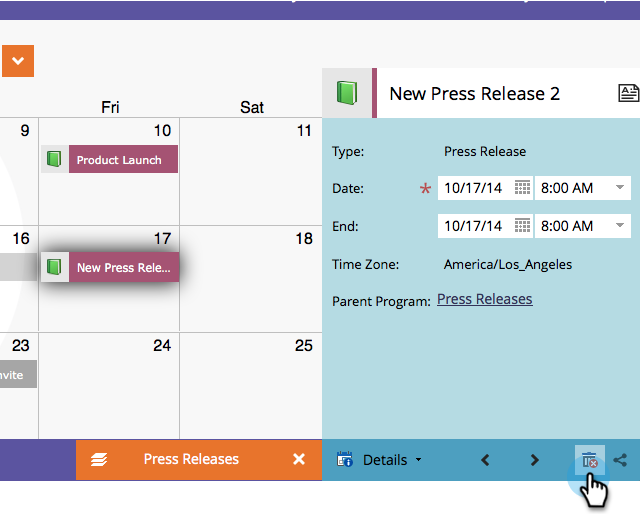

# 直接刪除行銷行事曆中的專案 {#delete-entries-directly-in-the-marketing-calendar}

除了 [建立](/help/marketo/product-docs/core-marketo-concepts/marketing-calendar/working-with-the-calendar/create-entries-directly-in-the-marketing-calendar.md){target="_blank"} and [editing](/help/marketo/product-docs/core-marketo-concepts/marketing-calendar/working-with-the-calendar/edit-entries-directly-in-the-marketing-calendar.md){target="_blank"} 您可以直接在行銷行事曆中刪除專案。 方法如下。

1. 按一下 **MU** 圖磚。

   

1. 選取要刪除的專案，然後按一下 **[!UICONTROL 顯示方案焦點]**.

   

1. 按一下垃圾桶圖示。

   

視專案而定，您可能需要確認刪除。 但僅此而已！

>[!MORELIKETHIS]
>
>[直接在行銷行事曆中確認專案](/help/marketo/product-docs/core-marketo-concepts/marketing-calendar/working-with-the-calendar/confirm-entries-directly-in-the-marketing-calendar.md){target="_blank"}
