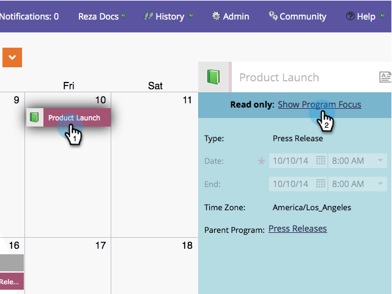

# 直接在行銷行事曆中編輯專案 {#edit-entries-directly-in-the-marketing-calendar}

進入程式焦點模式後，您可以快速變更行事曆專案。 方法如下。

## 啟用方案焦點 {#enable-program-focus}

1. 按一下 **[!UICONTROL 行事曆]** 圖磚。

   

1. 選取屬於您要著重的程式的專案，然後按一下 **[!UICONTROL 顯示方案焦點]**.

   

## 重新排程專案 {#reschedule-entry}

1. 只要拖放專案以重新排程即可。

   

## 編輯專案名稱 {#edit-entry-name}

1. 選取要重新命名的專案。

   

1. 編輯專案名稱。

   

   >[!TIP]
   >
   >您也可以編輯說明。
   >
   >

## 轉換專案型別 {#convert-entry-type}

快速輸入基本專案後，即可將其轉換為最終形式。

1. 尋找並選取要轉換的基本專案，然後變更其型別。

   

## 編輯專案詳細資訊 {#edit-entry-details}

您可以快速存取專案的不同區域以進行編輯。

1. 以滑鼠右鍵按一下專案，然後選取您要編輯的區域。

   

完成了！ 如您所見，您可以直接從行銷行事曆執行許多作業。

>[!MORELIKETHIS]
>
>[直接刪除行銷行事曆中的專案](/help/marketo/product-docs/core-marketo-concepts/marketing-calendar/working-with-the-calendar/delete-entries-directly-in-the-marketing-calendar.md){target="_blank"}
