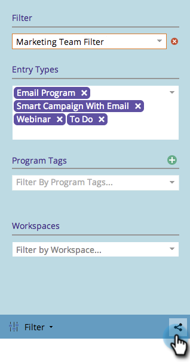

# 在行銷行事曆中共用篩選器定義 {#sharing-a-filter-definition-in-the-marketing-calendar}

不同使用者可以共用篩選器。

>[!PREREQUISITES]
>
>* [在行銷行事曆中建立篩選器](/help/marketo/product-docs/core-marketo-concepts/marketing-calendar/working-with-the-calendar/filtering-the-marketing-calendar.md)
>* [在行銷行事曆中儲存篩選器定義](/help/marketo/product-docs/core-marketo-concepts/marketing-calendar/working-with-the-calendar/saving-a-filter-definition-in-the-marketing-calendar.md)

>[!NOTE]
>
> 如果您變更已儲存的篩選器，請重新共用該篩選器；在您變更前，您所做的編輯將不會反映給其他使用者。

1. 選取要共用的篩選器。

   

1. 按一下右下角的共用圖示。

   

1. 複製URL並與其他Marketo使用者共用。

   

   >[!NOTE]
   >
   >使用者許可權會影響可見性。
