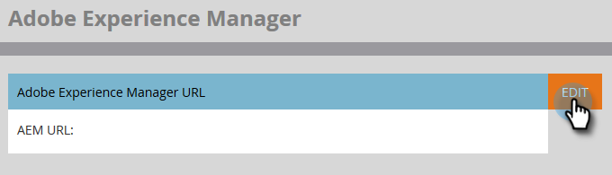

# 配置Adobe Experience Manager整合{#configuring-adobe-experience-manager-integration}

設定AEM，讓您存取、選取資產並匯AEM入Marketo的Design Studio。

>[!NOTE]
>
>**需要管理員權限**

>[!CAUTION]
>
>目前，此功能僅在Firefox中完全受支援。 Safari不支援此功能，而且可能無法在最新版Chrome(v. 80)中運作，視您的SameSite Cookie設定而定。

1. 導覽至Adobe Experience Manager（URL是您公司專屬的）。

   

1. 您可以使用Adobe登入，或在本機登入。 在此範例中，我們將在本機登入。

   

1. 在&#x200B;**工具**&#x200B;中，按一下&#x200B;**操作**&#x200B;並選擇&#x200B;**Web控制台**。

   

1. 在您的瀏覽器中，搜尋（Windows上的ctrl+f、Mac上的cmd+f）「AdobeGranite跨原始資源共用原則」。

   

1. 按一下右側的&#x200B;**+**&#x200B;簽名。

   

1. 在&#x200B;**允許的原點(Regexp)**&#x200B;文本框中，鍵入`https://.*\.marketo\.com`並按一下&#x200B;**保存**。

   

1. 在頁面頂部的標題中，按一下「Web控制台」(**)，然後選擇「System Information」（系統資訊）**。****

   

1. 在「伺服器資訊」下，按一下&#x200B;**重新啟動**&#x200B;按鈕。

   

1. 按一下&#x200B;**確定**&#x200B;確認。

   

1. 在Marketo Classic，按一下&#x200B;**管理**。

   

1. 在「整合」下，選擇&#x200B;**Adobe Experience Manager**。

   

1. 按一下&#x200B;**編輯**。

   

1. 輸入AEMURL，然後按一下「確定」。****

   

   你們都準備好了！ 您現在可以[將AEM資產匯入Design Studio中Marketo Sky](https://experienceleague.adobe.com/docs/marketo/sky/design-studio/importing-assets-with-adobe-experience-manager.html?lang=en#design-studio)。
