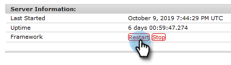

# 設定Adobe Experience Manager整合 {#configuring-adobe-experience-manager-integration}

設定AEM，讓您可以存取、選取AEM資產，並將其匯入Marketo的Design Studio。

>[!NOTE]
>
>**需要管理員權限**

>[!CAUTION]
>
>目前，此功能僅在Firefox中完全受支援。 Safari不支援此功能，而且可能無法在最新版Chrome(v. 80)中運作，視您的SameSite Cookie設定而定。

1. 導覽至Adobe Experience Manager（URL是您公司專屬的）。

   

1. 您可以使用Adobe登入，或在本機登入。 在此範例中，我們將在本機登入。

   

1. 在「工 **具**」中，按一下「 **操作** 」並選 **擇「Web控制台**」。

   

1. 在您的瀏覽器中，搜尋（Windows上的ctrl+f、Mac上的cmd+f）「Adobe Granite跨原始資源共用政策」。

   

1. 按一下 **右邊** 的+登入。

   

1. 在「允 **許的原點(Regexp)** 」文本框中，鍵入「https://」。*\.marketo\.com&quot;（不含引號），然後按一下「儲 **存**」。

   

1. 在頁面頂部的標題中，按一下「 **Web Console** 」（Web控制台）並選 **擇「System Information」（系統資訊）**。

   

1. 在「伺服器資訊」下，按一下「重 **新啟動** 」按鈕。

   

1. 按一 **下「確定** 」以確認。

   

1. 在Marketo Classic中，按一下「管 **理」**。

   

1. 在「整合」下方，選 **取「Adobe Experience Manager**」。

   

1. 按一 **下編輯**。

   

1. 輸入您的AEM URL，然後按一下「 **確定**」。

   

   你們都準備好了！ 您現在可 [以將AEM資產匯入Marketo Sky的Design Studio](http://help.marketo.com/hc/en-us/articles/360036765993)。

