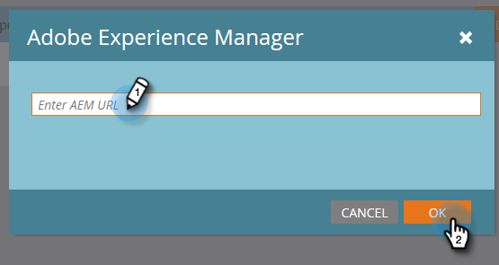

# 配置Adobe Experience Manager整合 {#configuring-adobe-experience-manager-integration}

配AEM置，以便您能夠訪問、選擇資AEM產並將其導入MarketoDesign Studio。

>[!NOTE]
>
>**需要管理權限**

>[!CAUTION]
>
>目前，此功能僅在Firefox中完全受支援。 Safari中不支援此功能，並且根據您的SameSite Cookie設定，它可能無法在最新版本的Chrome中使用。

1. 導航到Adobe Experience Manager（URL特定於您的公司）。

   

1. 您可以使用Adobe登錄或在本地登錄。 在此示例中，我們將在本地登錄。

   

1. 在 **工具**&#x200B;按一下 **操作** 選擇 **Web控制台**。

   

1. 在瀏覽器中，搜索(Windows上的ctrl+f,Mac上的cmd+f)「Adobe花崗岩跨源資源共用策略」。

   

1. 按一下 **+** 在右邊簽名。

   

1. 在 **允許的源(Regexp)** 文本框，鍵入 `https://.*\.marketo\.com` 按一下 **保存**。

   

1. 在頁面頂部的標題中，按一下 **Web控制台** 選擇 **系統資訊**。

   

1. 在「伺服器資訊」下，按一下 **重新啟動** 按鈕

   

1. 按一下 **確定** 確認。

   

1. 在Marketo Classic，按一下 **管理**。

   

1. 在整合下，選擇 **Adobe Experience Manager**。

   

1. 按一下 **編輯**。

   

1. 輸入AEMURL並按一下 **確定**。

   

   你都準備好了！ 你現在可以 [將資AEM產導入Design Studio inMarketo Sky](https://experienceleague.adobe.com/docs/marketo/sky/design-studio/importing-assets-with-adobe-experience-manager.html?lang=en#design-studio)。
