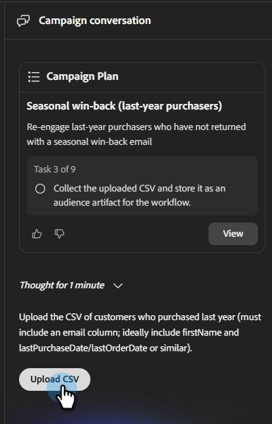

# 建立電子郵件行銷活動 {#create-an-email-campaign}

瞭解如何在幾分鐘內建立和檢閱完整的電子郵件行銷活動。

>[!IMPORTANT]
>
>目前，您只能建立行銷活動，無法傳送（啟動）行銷活動。 Launch功能即將推出。

## 開始之前

請確定您擁有：

* 有效的CX Enterprise Co-worker帳戶([在此註冊](https://coworker-essentials.experience.adobe.com/){target="_blank"} （如果尚未註冊）。

* 您的品牌設定在&#x200B;**您的資料** > **品牌**&#x200B;之下。

* （可選但建議使用）在&#x200B;**您的資料** > **電子郵件範本**&#x200B;下上傳的HTML電子郵件範本。

* 準備上傳的對象CSV。

* 清楚掌握行銷活動的目標（例如「贏回失效的客戶」或「邀請試用使用者參加網路研討會」）。

## 步驟1：開始新的聊天

從首頁開始，您有三種方法：

**選項一**：在中央提示列中鍵入提示。

_使用時機：您明確知道想要什麼的時候。_

**選項二**：從提示列下方的&#x200B;**行銷活動範本**&#x200B;區段中，挑選現成的範本。

_何時使用：當您不確定所要時。_

**選項三**：使用提示列下拉式清單中的[協助我提示]選項，讓CX Enterprise Co-worker引導您撰寫提示。

_使用時機：您可能知道您想要什麼，但想要一點協助（或使用「驚喜我」來讓我驚訝）時。_

{width="800" zoomable="yes"}

## 步驟2：建立提示

強大的CX Enterprise Co-worker提示包括：

* 行銷活動目標（您正在嘗試達成的目標）。
* 對象（對象是誰，或對象資料的來源）。
* 格式和結構（電子郵件數量、步調、色調）。
* 品牌或內容提示（參考您的品牌、產品或行銷活動）。

範例：

`"Create a single-touch win-back email campaign for customers who bought last year but haven't returned. Use the CSV I am uploading. Make sure the content feels seasonal."`

>[!TIP]
>
>如需更多範例，請參閱&#x200B;_使用案例_&#x200B;文章。

>[!NOTE]
>
>如果您已有行銷活動簡報，請連同您的提示一起上傳，作為為您建立之計畫的額外內容。

當您準備好提示時，請按一下[產生行銷活動]。**&#x200B;** CX Enterprise Co-worker將會：

* 產生結構化的行銷活動計畫。
* 詢問您的目標對象，這些對象也會用於內容個人化。
* 草稿每個步驟的個人化電子郵件內容。
* 在此過程中以動態方式建置歷程。
* 將所有內容組合在單一行銷活動展示板上。

## 步驟3：上傳您的對象

對象是透過CSV上傳。 所有對象都特定於其各自的促銷活動。

1. 送出提示後，請檢閱Co-worker將執行的工作，然後按一下&#x200B;**建置**。

1. 在左側的&#x200B;_促銷活動轉換_&#x200B;窗格中，按一下&#x200B;**上傳CSV**。

   

   >[!NOTE]
   >
   >* 電子郵件地址是必填欄位，建議使用名字和其他可用於個人化的欄位。
   >
   >* CX Enterprise Co-worker可以使用個人化欄位：名字、上次訂購日期、產品類別。

1. 匯入您的CSV檔案。

   >[!TIP]
   >
   >在上傳之前，排除您不想以電子郵件傳送的任何連絡人（取消訂閱的使用者、內部地址、測試帳戶）。 雖然我們將在試用期間逐步啟用「排除」特定使用者或「新增屬性」功能，但自推出日期起將無法立即使用。

## 步驟4：檢閱和調整Campaign Assets

若要變更電子郵件，請向右捲動。 在&#x200B;_促銷活動Assets_&#x200B;底下，按一下&#x200B;**開啟編輯器**。

更新您的內容有兩種方式。

* 選取電子郵件中的各個區段，手動進行任何需要的變更（例如：取代主旨行、更新影像等）。

 — 或 — 

* 使用對話式介面，直接與CX Enterprise Co-worker交談以進行變更。 部分範例包括：

   * 「讓主旨列更緊急。」
   * 「縮短正文復本。」
   * 「讓call to action更強大。」
   * 「將等待時間從3天變更為5天。」

您也可以使用AI按鈕來協助調整您的「主旨」或「預覽文字」。

## 步驟5：傳送測試電子郵件

在啟動之前，請將行銷活動傳送給您自己，以便您可以在真正的收件匣中檢閱。 使用此選項可確保電子郵件以您想要的方式呈現、連結正常運作、任何個人化皆準確無誤等。

>[!NOTE]
>
>目前，您只能傳送測試電子郵件給自己，一次只能傳送一封電子郵件。

## 步驟6：下一步

Launch功能（傳送您的電子郵件行銷活動）即將推出。 在此之前，您可以與團隊檢閱內容，並開始您的下一個行銷活動。

## 常見問題集

**為什麼第一個回應需要這麼長時間？**

它正在為您產生整個行銷活動，包括策略、您需要的對象、工作流程等（聆聽錄製1:15ish標籤）

**如果CX Enterprise Co-worker輸出不太正確怎麼辦？**

使用右上方的意見回饋按鈕，通知我們以便我們改善平台。

**我可以直接編輯電子郵件，還是只能透過聊天編輯？**

您可以同時執行這兩項操作。

**如何儲存行銷活動而不啟動它？**

所有行銷活動都會自動儲存。 如果您需要存取最近的交談，可在左側的視窗中使用（如果您尚未建置行銷活動，則在&#x200B;**聊天**&#x200B;下；如果您有，則在&#x200B;**行銷活動**&#x200B;下）。

**我的CSV上傳是否有檔案大小限制？**

是，大小限製為8MB。

**如果我的對象CSV傳回錯誤怎麼辦？**

確認您的CSV檔案未包含「rich」隱藏字元。

**如何使用行銷活動範本？**

選取想要的範本，然後按一下&#x200B;**混音**。 然後您可以更新所有個人化權杖，並按一下右下角的&#x200B;**傳送**&#x200B;圖示。

**如何與隊友共用行銷活動草稿以供檢閱？**

目前沒有「共用」按鈕。 不過，您可以將內容下載為HTML，或將其匯出為PDF或Word檔案。
