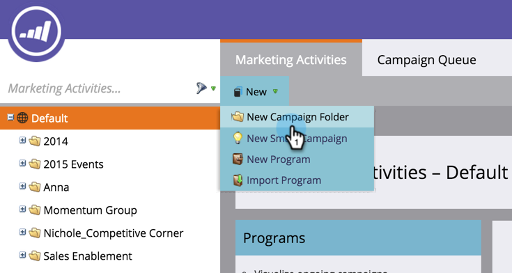

# 建立新的促銷活動資料夾 {#create-new-campaign-folder}

行銷活動資料夾可協助您保持整潔的工作區。 請依照這些簡單步驟操作，您即將實現自動化魔力。

1. 前往 **行銷活動**.

   

1. 選擇 **新增**.

   

1. 選擇 **新增促銷活動資料夾**.

   

1. 輸入 **名稱** （促銷活動資料夾）。

   

1. 可選：輸入 **說明** 按一下 **建立**.

   >[!TIP]
   >
   >說明適用於訂閱上的其他使用者。 您的客戶將看不到此訊息。

   

   太棒了！ 您剛建立了行銷活動資料夾。 去樹上看看。

   

   現在，當 [建立新方案](/help/marketo/product-docs/core-marketo-concepts/programs/creating-programs/create-a-program.md)，您會看到此促銷活動資料夾作為選項。

>[!MORELIKETHIS]
>
>* [建立方案](/help/marketo/product-docs/core-marketo-concepts/programs/creating-programs/create-a-program.md)
>* [建立新的智慧型促銷活動](/help/marketo/product-docs/core-marketo-concepts/smart-campaigns/creating-a-smart-campaign/create-a-new-smart-campaign.md)

