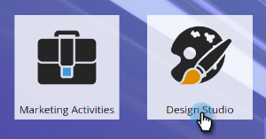

# 匯入具有Adobe Experience Manager{#importing-assets-with-adobe-experience-manager}的資產

「資產選擇器」可讓Marketo客戶存取、選擇AEM資產並匯入Marketo的Design Studio。 **需要管理員權限**。

>[!AVAILABILITY]
>
>
>並非所有客戶都購買過此功能。 如需詳細資訊，請連絡您的客戶成功經理。

>[!PREREQUISITES]
>
>請確定您已經執行了[AEM Configuration](/help/marketo/product-docs/core-marketo-concepts/miscellaneous/configuring-adobe-experience-manager-integration.md)。

>[!CAUTION]
>
>目前，此功能僅在Firefox中完全受支援。 Safari不支援此功能，而且可能無法在最新版Chrome(v. 80)中運作，視您的SameSite Cookie設定而定。

1. 按一下「**Design Studio**」。

   

1. 按一下「新增」下拉式清單，然後選取「從Adobe Experience Manager匯入」。****

   

1. 選擇影像儲存至的檔案夾。

   

1. 登入Adobe Experience Manager（如果您尚未登入）。

   

1. 選擇您的資料夾。 然後按一下縮圖以選取您想要的影像（最多可以選取10張）。 完成時，按一下「**選擇**」。

   

   >[!NOTE]
   >
   >影像大小不能超過100MB。

1. 按一下&#x200B;**Import**&#x200B;以完成該過程。

   

   就這樣！ 按一下&#x200B;**關閉**&#x200B;以返回Design Studio。

   

## 注意事項{#things-to-note}

Marketo目前支援Adobe Experience Manager6.4和6.5版。

您實例中的所有用戶都可以查看／訪問您導入的映像。

影像不會自動更新。 如果導入到MarketoDesign Studio的映像在中更新AEM，則必須手動將其重新導入Marketo。
