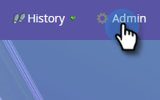
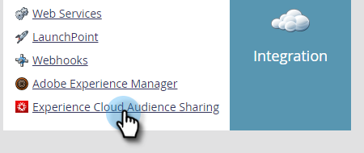

# 設定Adobe Experience Cloud觀眾分享{#set-up-adobe-experience-cloud-audience-sharing}

若要將觀眾資料分享至您的Adobe應用程式，您必須先在Marketo中輸入您的AdobeIMS組織認證。 這是方法。

>[!NOTE]
>
>Marketo例項的HIPAA適用部署無法使用此整合。

1. 在Marketo中，按一下&#x200B;**管理**。

   

1. 在「整合」下，按一下「Experience Cloud觀眾共用」**。**

   

1. 按一下&#x200B;**編輯**。

   

1. 輸入您的AdobeIMS組織ID（瞭解如何在[這裡](https://docs.adobe.com/content/help/en/control-panel/using/faq.html)找到），然後按一下&#x200B;**確定**。

   

1. 按一下&#x200B;**確認**。

   

1. 按一下&#x200B;**關閉**。

   

   >[!NOTE]
   >
   >出於安全原因，您必須是要映射至的Adobe組織的組織管理員。 如果您不是，動作就會失敗。

1. 如果您&#x200B;_not_&#x200B;已登入，則新標籤／視窗中會出現快顯視窗。 登入Adobe組織（此活動驗證組織訪問權限）。

就這樣！ 您現在可以[共用觀眾資料](/help/marketo/product-docs/core-marketo-concepts/smart-lists-and-static-lists/static-lists/send-a-list-to-adobe-experience-cloud.md)至或[同步來自Adobe Experience Cloud的觀眾](/help/marketo/product-docs/core-marketo-concepts/miscellaneous/sync-an-audience-from-adobe-experience-cloud.md)。
