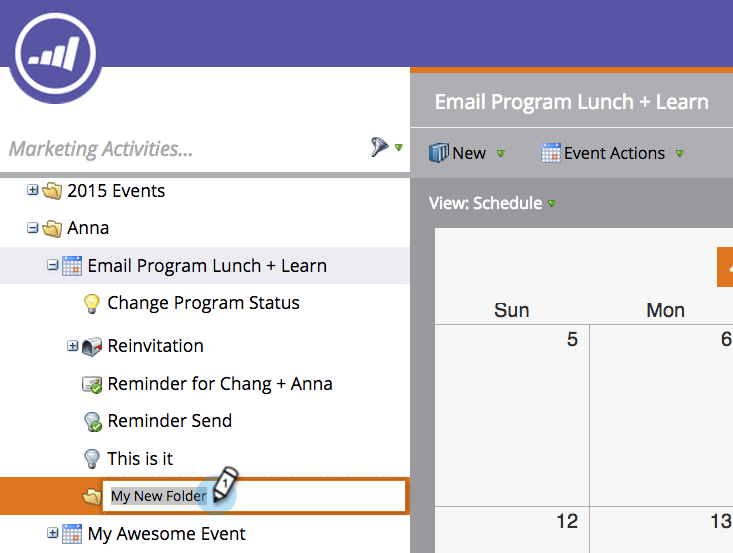
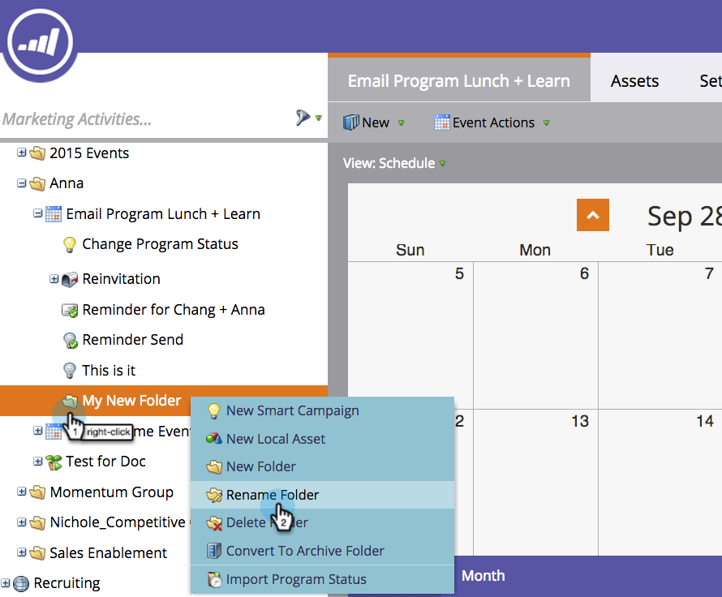
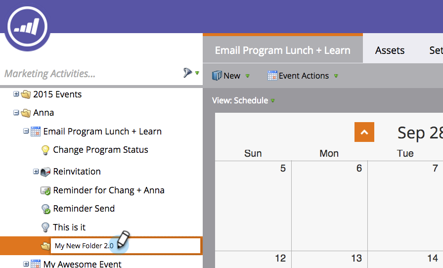
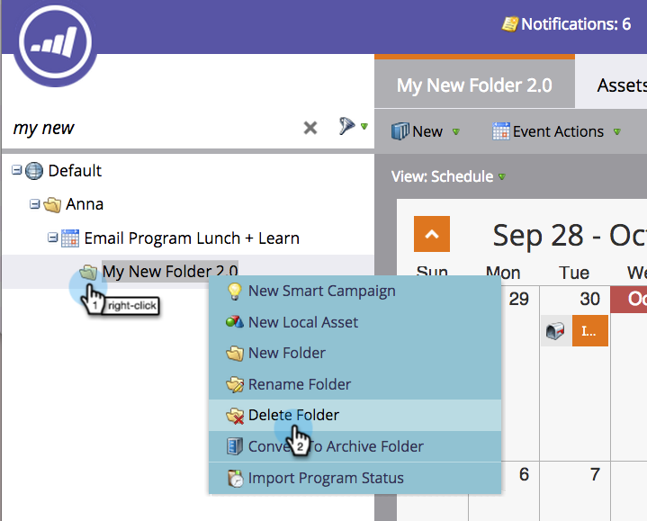

# 了解資料夾 {#understanding-folders}

方案內的資料夾可用於組織您的智慧行銷活動和資產。 這些資料夾與[行銷活動資料夾](/help/marketo/product-docs/core-marketo-concepts/miscellaneous/create-new-campaign-folder.md)不同。

## 建立資料夾 {#create-a-folder}

1. 前往「**[!UICONTROL Marketing Activities]**」區域。

   

1. 以滑鼠右鍵按一下方案，然後選取&#x200B;**[!UICONTROL New Folder]**。

   

1. 為新資料夾命名，然後按&#x200B;**[!UICONTROL Enter]**。

   

新資料夾現在已可供您的本機資產使用。

## 重新命名資料夾 {#rename-a-folder}

1. 以滑鼠右鍵按一下資料夾，然後選取 **[!UICONTROL Rename Folder]**。

   

1. 輸入新名稱，然後按&#x200B;**[!UICONTROL Enter]**。

   

## 刪除資料夾 {#delete-a-folder}

>[!NOTE]
>
>刪除資料夾之前，請確定資料夾是空的。

1. 以滑鼠右鍵按一下資料夾，然後選取 **[!UICONTROL Delete Folder]**。

   

## 封存資料夾 {#archive-a-folder}

在Marketo中，您可以將現有資料夾轉換為封存資料夾。 封存資料夾存在於[!UICONTROL Marketing Activities]、[!UICONTROL Database]和[!UICONTROL Design Studio]中。

封存資料夾時：

* 資料夾和資產不再顯示於搜尋結果中。 如果您搜尋已封存資料夾內的方案或事件，結果會傳回已封存資料夾的摺疊檢視
* 資料夾中的資產不再出現在自動建議中
* 在Design Studio中建立電子郵件或登陸頁面時，無法使用封存的範本
* 已封存的頁面無法用於登入頁面測試群組

封存時&#x200B;**不會**&#x200B;變更的功能：

* 全域搜尋仍會在封存的資料夾中找到結果
* 即使已封存使用中的資產，資產仍會繼續運作
* 您可以使用篩選器來選取要用於報表中的已封存資產
* 封存的資產不會停用。 如果您希望它們停止執行，也必須停用它們
