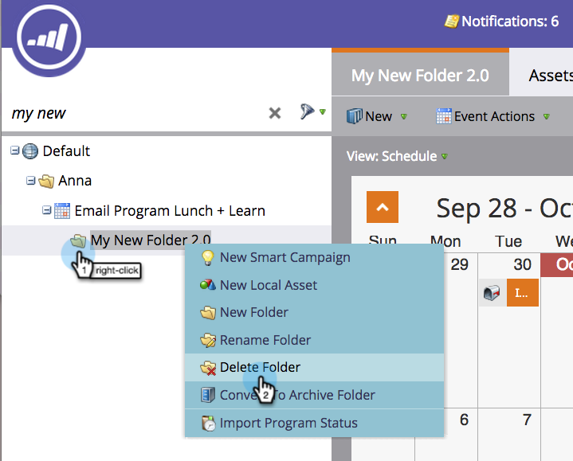

# 瞭解資料夾 {#understanding-folders}

方案內的資料夾可用於組織您的智慧行銷活動和資產。 這些資料夾與[行銷活動資料夾](/help/marketo/product-docs/core-marketo-concepts/miscellaneous/create-new-campaign-folder.md)不同。

## 建立資料夾 {#create-a-folder}

1. 前往「**[!UICONTROL Marketing Activities]**」區域。

   

1. 以滑鼠右鍵按一下方案，然後選取&#x200B;**[!UICONTROL New Folder]**。

   {width="600" zoomable="yes"}

1. 為新資料夾命名，然後按&#x200B;**[!UICONTROL Enter]**。

   {width="600" zoomable="yes"}

新資料夾現在已可供您的本機資產使用。

## 重新命名資料夾 {#rename-a-folder}

1. 以滑鼠右鍵按一下資料夾，然後選取 **[!UICONTROL Rename Folder]**。

   {width="600" zoomable="yes"}

1. 輸入新名稱，然後按&#x200B;**[!UICONTROL Enter]**。

   {width="600" zoomable="yes"}

## 刪除資料夾 {#delete-a-folder}

>[!NOTE]
>
>刪除資料夾之前，請確定資料夾是空的。

1. 以滑鼠右鍵按一下資料夾，然後選取 **[!UICONTROL Delete Folder]**。

   {width="600" zoomable="yes"}

## 封存資料夾 {#archive-a-folder}

在Marketo中，您可以將現有資料夾轉換為封存資料夾。 封存資料夾存在於[!UICONTROL Marketing Activities]、[!UICONTROL Database]和[!UICONTROL Design Studio]中。

{width="600" zoomable="yes"}

封存資料夾時：

* 資料夾和資產不再顯示於搜尋結果中。 如果您搜尋已封存資料夾內的方案或事件，結果會傳回已封存資料夾的摺疊檢視
* 資料夾中的資產不再出現在自動建議中
* 在Design Studio中建立電子郵件或登陸頁面時，無法使用封存的範本
* 已封存的頁面無法用於登入頁面測試群組

封存時&#x200B;**不會**&#x200B;變更的功能：

* 全域搜尋仍會在封存的資料夾中找到結果
* 您可以使用篩選器來選取要用於報表中的已封存資產

### 在封存上停用行銷活動 {#disable-campaigns-archive}

封存資料夾或方案時，或將作用中的智慧型行銷活動移至已封存的資料夾時，Marketo Engage會停止執行受影響的行銷活動：

* **觸發的行銷活動**&#x200B;已停用。
* **批次行銷活動**&#x200B;的擱置執行已取消。
* **可執行行銷活動**&#x200B;沒有執行中的狀態，因此不會採取任何動作。

**支援的動作**

下列動作會停用行銷活動：

* 將包含作用中行銷活動的&#x200B;**資料夾**&#x200B;拖放至已封存的資料夾
* 將包含作用中行銷活動的&#x200B;**方案** （任何型別）拖放至已封存的資料夾
* 將&#x200B;**單一智慧行銷活動**&#x200B;拖放至已封存的資料夾
* 在單一智慧行銷活動上以滑鼠右鍵按一下&#x200B;**將**&#x200B;移至封存的資料夾
* 在包含作用中行銷活動的資料夾上按一下滑鼠右鍵&#x200B;**將資料夾**&#x200B;移動至已封存的資料夾
* 在包含作用中行銷活動的方案上按一下滑鼠右鍵&#x200B;**將**&#x200B;移動至已封存的資料夾
* 在資料夾上按一下滑鼠右鍵&#x200B;**「轉換為封存的資料夾**」，將其封存到適當位置而不移動它

>[!NOTE]
>
>如果其他地方參照了正在封存的資料夾或方案內的智慧行銷活動（例如，透過「請求行銷活動」流程步驟），封存會遭到封鎖以防止破壞另一個行銷活動。
