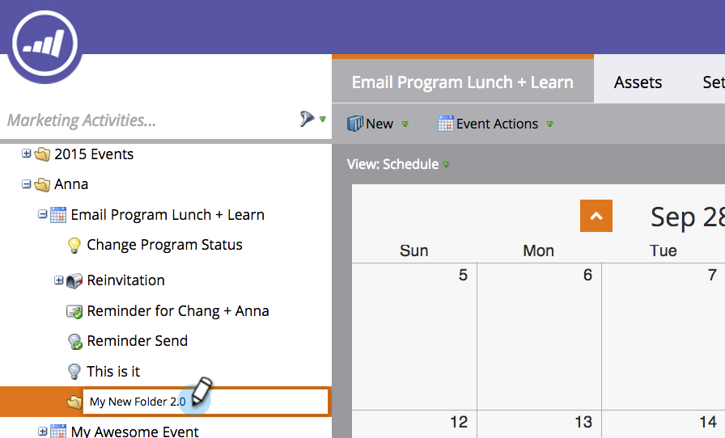

# 瞭解資料夾{#understanding-folders}

程式中的資料夾可用來組織您的智慧型促銷活動和資產。 這與[促銷活動資料夾](/help/marketo/product-docs/core-marketo-concepts/miscellaneous/create-new-campaign-folder.md)不同。

## 建立資料夾{#create-a-folder}

1. 前往&#x200B;**行銷活動**&#x200B;區域。

   

1. 按一下右鍵程式並選擇「新建資料夾」。****

   

1. 為新資料夾命名，然後按&#x200B;**Enter**&#x200B;鍵。

   

太好了！ 現在，您有新資料夾可儲存本機資產。

## 更名資料夾{#rename-a-folder}

改主意沒關係。

1. 按一下右鍵該資料夾並選擇「更名資料夾」。****

   

1. 鍵入新名稱，然後按&#x200B;**Enter**&#x200B;鍵。

   

   還有沃利亞！ 該資料夾具有新名稱。

## 刪除資料夾{#delete-a-folder}

>[!NOTE]
>
>刪除資料夾前，請確定該資料夾為空。

1. 按一下右鍵該資料夾並選擇&#x200B;**刪除資料夾**。

   

   Adios資料夾！

## 封存資料夾{#archive-a-folder}

在Marketo，您可以將現有資料夾轉換為「存檔」資料夾。 Marketing Activitys、Database和Design Studio中存在封存檔案夾。

封存資料夾時：

* 資料夾和資產在搜尋結果中不再顯示。 如果您搜尋已封存檔案夾內的程式或事件，結果會傳回已封存檔案夾的收合檢視
* 資料夾中的資產不再顯示在自動建議中
* 在Design Studio中建立電子郵件或登陸頁面時，無法使用封存的範本
* 封存頁面無法用於著陸頁面測試群組

在封存時，**not**&#x200B;會變更的功能：

* 全局搜索仍在歸檔資料夾中查找結果
* 使用中的資產即使在封存後仍能繼續運作
* 您可以使用篩選器來選取要用於報表的已封存資產
* 封存的資產不會停用。 如果您希望它們停止執行，也必須停用
