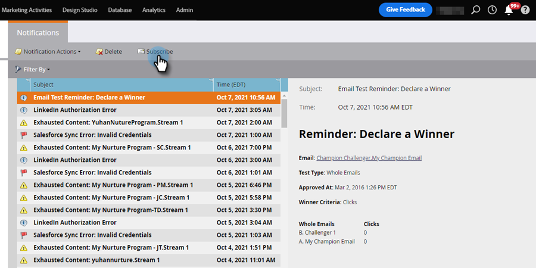
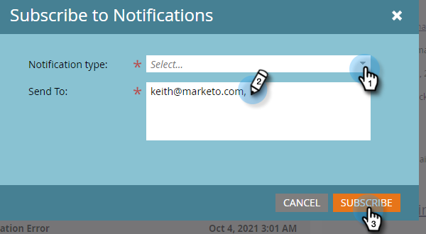

# 了解通知 {#understanding-notifications}

通知可讓您掌握Marketo訂閱中發生的系統事件最新資訊。 例如，促銷活動失敗通知會通知您智慧型促銷活動中的錯誤，而CRM同步通知會提醒您CRM同步發現的重大問題，例如權限不正確或同步中斷。

## 概述 {#overview}

1. 新通知會顯示在Marketo的右上角。

   

1. 按一下「通知」以檢視所有通知。

   

## 訂閱通知 {#subscribe-to-notifications}

您可以訂閱通知，以在電子郵件中接收通知。

1. 前往「通知」，然後按一下「**訂閱**」。

   

1. 選取通知類型，然後輸入要傳送通知的電子郵件地址（以逗號分隔）。 完成後，按一下「**訂閱**」。

   

>[!NOTE]
>
>**send to**&#x200B;區域僅供您輸入電子郵件，不會顯示現有訂閱者的清單。

在某些情況下，通知會提供「查看完整清單」連結，以下載逗號分隔值(CSV)檔案，例如Microsoft Dynamics Sync Errors檔案。 Marketo會保留這些CSV檔案30天。 如果您嘗試在30天後下載檔案，將會收到404錯誤。

>[!TIP]
>
>想取消訂閱通知電子郵件嗎？ 沒問題。 只需按一下電子郵件底部的&#x200B;**取消訂閱通知**&#x200B;連結即可。
