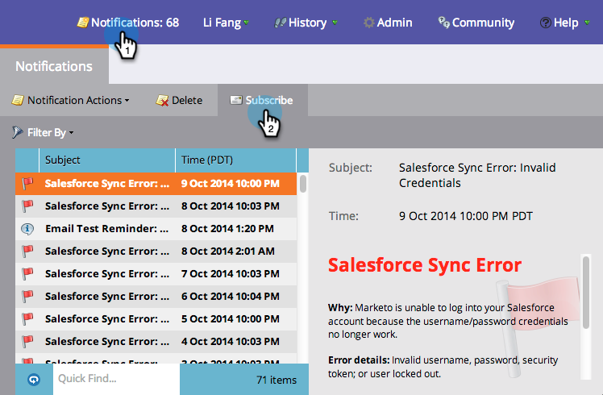

# 瞭解通知{#understanding-notifications}

通知可讓您隨時掌握Marketo訂閱中發生的系統事件。 例如，促銷活動失敗通知會通知您智慧型促銷活動中的錯誤，而CRM同步通知會提醒您CRM同步發現的重大問題，例如權限不正確或同步中斷。

## 概述{#overview}

1. 新通知會出現在Marketo的右上方。

   

1. 按一下「通知」以檢視您的所有通知。

   

## 訂閱通知{#subscribe-to-notifications}

您可以訂閱通知，以便在電子郵件中接收通知。

1. 前往「通知」，然後按一下「訂閱」。

1. 選擇「通知類型」，然後輸入要傳送通知的電子郵件地址。

   

>[!NOTE]
>
>在某些情況下，通知會提供「查看完整清單」連結，以下載逗號分隔值(CSV)檔案，例如Microsoft Dynamics Sync Errors檔案。 Marketo會將這些CSV檔案保存30天。 如果您在30天後嘗試下載檔案，將會出現404錯誤。

>[!TIP]
>
>想要取消訂閱通知電子郵件嗎？ 沒問題。 只要按一下電子郵件底部的&#x200B;**取消訂閱通知**&#x200B;連結即可。
