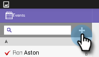

# 從平板電腦將人員簽入您的活動 {#check-people-into-your-event-from-your-tablet}

當人們出現在您的活動中時，您就可以在應用程式中找到其資訊。 登入後，當您同步至Marketo時，他們會升級為已參加狀態。

除了微幅版面配置和設計差異外，應用程式在iPad和Android上的運作方式相同。

>[!PREREQUISITES]
>
>* 在Marketo中建立事件，並填入「受邀」和「已註冊的人員」。
>* 下載適用於的平板電腦應用程式 [Android](https://play.google.com/store/apps/details?id=com.marketo.eventcheckin&amp;hl=en) 或 [iOS](https://itunes.apple.com/us/app/marketo-events/id522766637?mt=8)

## 簽入註冊來賓 {#check-in-registered-guests}

1. 點選iPad或Android平板電腦上的應用程式圖示。

1. 點選 **登入** 啟動Marketo Event應用程式時，此欄位會加以追蹤。

   

1. 輸入您的Marketo使用者名稱和密碼，然後按一下 **登入**.

   >[!NOTE]
   >
   >您必須擁有可存取資料庫的角色，才能查看應用程式中的人員。

1. 選取 **事件**.

   

   >[!TIP]
   >
   >只會顯示在今天日期之前一週和之後一週排程的活動方案（網路研討會除外）。

1. 在主螢幕上，瀏覽以查找已註冊的來賓。 若要在清單中尋找人員，您可以：

   * 滾動以查找名稱
   * 在搜索欄位中輸入名稱
   * 點選清單右側的字母，跳至姓氏的特定首字母

   >[!NOTE]
   >
   >iPad和Android上的程式相同，但畫面不同，且項目可能位於不同位置。 本文介紹iPad介面。 比較本節中的Android畫面以供參考。

   **iPad**

   

   **Android**

   

1. 點選選取的名稱，然後在人員記錄上點選 **簽入**.

   

來賓現在具有已出席狀態，並收到複選標籤。 當您與Marketo同步時，會更新人員記錄。 「同步」按鈕上的紅色計數器會增加，以顯示自上次同步至Marketo以來的簽入次數。 iPad和Android的「同步」按鈕看起來不同，所在位置不同：

**iPad**

**Android**

>[!TIP]
>
>如果某人受邀但尚未註冊，您可以按一下「 」以搜尋該名稱 **在伺服器上搜索**，位於「搜尋」方塊下方。 「已邀請」狀態變更為 **已出席** 的URL區段。

## 在平板電腦上建立新人員 {#create-a-new-person-on-the-tablet}

您可以手動新增非Marketo資料庫中現有人員的來賓。 當您與Marketo同步時，系統會自動將其簽入並新增至您的資料庫。

1. 按一下 **新增**.

   **iPad**

   

   **Android**

   

1. 請盡可能填寫基本資訊欄位，並點選 **完成**.

   

   >[!NOTE]
   >
   >您只能使用現有欄位。 您無法建立自訂項目。

   >[!CAUTION]
   >
   >仔細檢查電子郵件地址。 其他欄位稍後可以更正，但電子郵件地址是聯絡訪客的主要方法。

新人員已註冊為已簽入您的活動，當您同步到Marketo時，將會新增至狀態為「已出席」的Marketo資料庫。

## 撤消簽入 {#reverse-a-check-in}

如果你誤簽了人， _在同步前與Marketo_，您可以反轉「已出席」狀態。

1. 點選清單中的名稱，然後在人員記錄中，點選 **還原**.

   

   都修好了！

## 在簽入時編輯人員記錄 {#edit-a-person-record-at-check-in}

您可以直接在事件中新增和修改來賓資訊！

1. 點選「人物」清單中的名稱，然後點選 **編輯**.

   

1. 編輯資訊並新增至欄位，然後點選 **完成**.

   

   >[!NOTE]
   >
   >在Android中， **完成** 按鈕。 向下捲動以尋找它。

當您將應用程式與Marketo同步時，資訊將會更新。

## 將應用程式與Marketo同步 {#sync-the-app-with-marketo}

Marketo事件應用程式可獨立運作，直到您將活動同步回Marketo資料庫為止。 最好在上次簽入後盡快同步。 您的平板電腦必須連接至網際網路。

>[!CAUTION]
>
>同步後，您無法從應用程式中反轉簽入。

1. 在您的平板電腦上，開啟應用程式並導覽至您的事件。

1. 點選 **同步**.

   您的事件會以Marketo資料庫中的新登入項目更新。 「同步」按鈕上的紅色計數器會清除，直到您勾選了其他人。

   基於安全考量，完成同步後，您應該退出Marketo事件應用程式。

## 使用有限的Internet訪問 {#working-with-limited-internet-access}

有些場所的網際網路連接很差。 您需要良好的連線：

* 下載並安裝應用程式
* 登入
* 選取事件
* 將應用程式與Marketo同步

若您對於場地的網際網路存取有所顧慮，您可能想要登入Marketo事件應用程式，並在網際網路存取能力強的位置提前選取您的活動。 如此一來，您仍可離線使用應用程式。 然後，當您重新獲得Internet連接時，立即同步到Marketo資料庫。

>[!TIP]
>
>如果您沒有網際網路連線，您仍然可以為登入的人員建立新的人員。 當您同步應用程式時，它會與現有人員調解。

>[!NOTE]
>
>應用程式會在您閒置8小時後自動將您登出。
