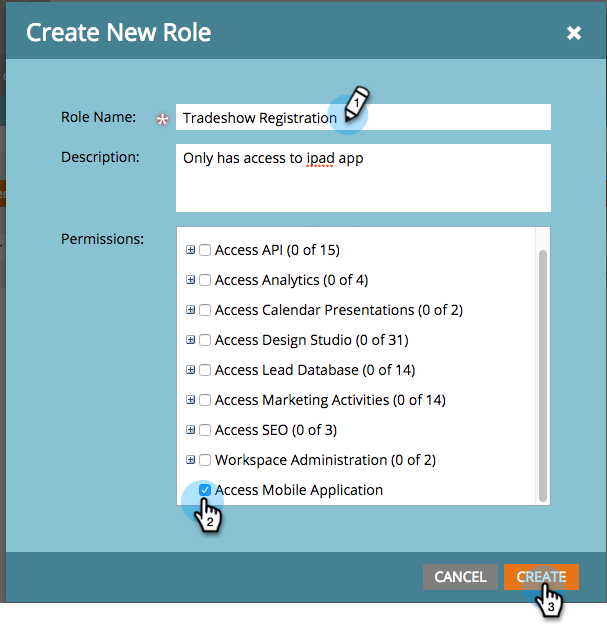

# 授予使用者存取登入應用程式的權限{#grant-users-access-to-the-check-in-app}

Marketo對活動登入應用程式有特殊的使用者角色。 以下說明如何建立具有使用應用程式權限的新角色。

## 建立行動裝置的新使用者角色{#create-a-new-user-role-for-mobile}

1. 按一下&#x200B;**管理**。

   

1. 按一下「**用戶和角色**」。

   

1. 按一下&#x200B;**角色**&#x200B;頁籤，然後按一下&#x200B;**新角色**。

   

1. 輸入新角色的名稱和可選說明。 選中&#x200B;**訪問移動應用程式**&#x200B;框，然後按一下&#x200B;**建立**。

   

   當您邀請人員使用平板電腦應用程式時，新角色已可供指派。

## 邀請新使用者加入登入應用程式{#invite-new-users-for-the-check-in-app}

1. 按一下&#x200B;**Users**&#x200B;頁籤。

   

1. 按一下「邀請新使用者」。****

   

1. 輸入新用戶的資訊。 選取所有適當角色的核取方塊，以及具有存取行動應用程式權限的新角色。 完成時，按一下「邀請」。****

   

   >[!CAUTION]
   >
   >沒有資料庫存取權的使用者在應用程式中看不到任何人。

   >[!TIP]
   >
   >對於現有用戶，您可以建立新角色或將「存取行動應用程式」權限新增至目前角色。

使用者會收到電子郵件，告知他們可以存取登入應用程式。
