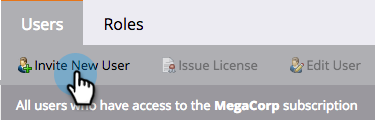

# 授予使用者簽入應用程式的存取權 {#grant-users-access-to-the-check-in-app}

Marketo對事件簽入應用程式具有特殊的使用者角色。 以下說明如何建立具有使用應用程式權限的新角色。

## 為行動裝置建立新使用者角色 {#create-a-new-user-role-for-mobile}

1. 按一下 **管理**.

   

1. 按一下 **使用者與角色**.

   

1. 按一下 **角色** ，然後按一下 **新角色**.

   

1. 輸入新角色的名稱，並輸入可選說明。 檢查 **存取行動應用程式** 框，按一下 **建立**.

   

   當您邀請使用者使用平板電腦應用程式時，即可指派新角色。

## 邀請簽入應用程式的新用戶 {#invite-new-users-for-the-check-in-app}

1. 按一下 **使用者** 標籤。

   

1. 按一下 **邀請新用戶**.

   

1. 輸入新用戶的資訊。 選取所有適當角色的核取方塊，以及具有存取行動應用程式權限的新角色。 按一下 **邀請** 等你完事了。

   

   >[!CAUTION]
   >
   >無權存取資料庫的使用者在應用程式中看不到任何人員。

   >[!TIP]
   >
   >對於現有用戶，您可以建立新角色或將「訪問移動應用程式」權限添加到當前角色。

使用者會收到電子郵件，告知他們有權存取簽入應用程式。
