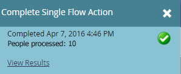

# 為您的事件做準備 {#prepare-for-your-event}

為了準備好迎接活動，您必須執行幾項操作。

## 建立新的Marketo角色 {#create-a-new-marketo-role}

Marketo對事件簽入應用程式具有特殊的使用者角色。 [建立新的Marketo角色](/help/marketo/product-docs/core-marketo-concepts/mobile-apps/event-check-in/grant-users-access-to-the-check-in-app.md) iPad或Android使用者，具有存取行動應用程式的權限。

## 邀請新的平板電腦使用者參加活動 {#invite-new-tablet-users-to-the-event}

[邀請新的平板電腦使用者參加活動](/help/marketo/product-docs/core-marketo-concepts/mobile-apps/event-check-in/grant-users-access-to-the-check-in-app.md) 並為他們指派新角色。

## 建立新的Marketo事件方案 {#create-a-new-marketo-event-program}

[建立新的Marketo事件方案](/help/marketo/product-docs/demand-generation/events/understanding-events/create-a-new-event-program.md) 擷取人員在不同階段中的狀態，並針對您的行銷計畫取得準確的投資報酬率測量。

## 指定事件日期 {#specify-the-event-dates}

設定事件日期很簡單。

1. 按一下排程上的事件，並設定開始和結束日期與時間。

   

1. 滑過以更改 **暫定** to **已確認**.

   

   >[!CAUTION]
   >
   >如果事件的日期在目前日期之前或之後超過一週，您的事件將不會顯示在應用程式中。 **筆尖**:若要測試，請暫時將日期設為今天的一週內。 在測試後，請記得將事件傳回至正確的日期。

## 將人員新增至您的活動 {#add-people-to-your-event}

既然你知道 *when*，是時候將 *誰*.

1. 如果您已有人員清單，請在「我的Marketo」中按一下 **資料庫** 方塊。

   

1. 選取包含人員的清單，然後按一下 **人員** 標籤。

   

1. 從清單中選取活動的人員。 使用 **Ctrl** (或 **命令** 在Mac上)，按一下多個人，或 **全選** 來標籤所有的。

   

1. 按一下 **人員動作**，暫留 **方案** 選取 **更改程式狀態**.

   

1. 按一下 **方案** 下拉式清單中，然後選取您的事件。

   

1. 按一下 **新狀態** 下拉式清單並選取 **路演>註冊**. 按一下 **立即運行**.

   

1. 小窗口顯示進度……

   

1. ...並指示任務何時完成。

   

   選取的人員現在已進入您的活動，可以使用展會展示板上的平板電腦應用程式簽入。
