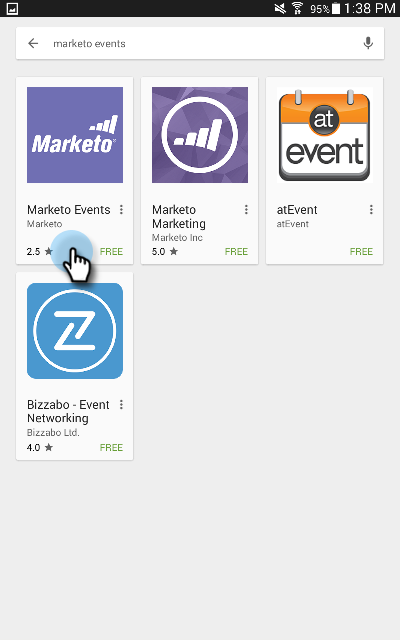

# 設定iPad或Android平板電腦 {#set-up-the-ipad-or-android-tablet}

為了在活動日獲得順暢的體驗，請在活動前準備iPad或Android平板電腦，並測試Marketo Events應用程式。

在Marketo中建立事件後，如果您符合下列條件，系統會在您登入時載入至Marketo事件iPad或Android應用程式：

* 該帳戶可存取您的資料庫
* 事件排程的日期所處的時段，開始日期為目前日期的前一週，結束日期為目前日期後一週
* 事件是在適當的管道中建立（例如Roadshow）

>[!NOTE]
>
>您必須連線至網際網路才能下載應用程式。

## 下載並安裝Marketo Events iPad應用程式 {#download-and-install-the-marketo-events-ipad-app}

如果您的iPad尚未安裝Marketo Events應用程式，以下說明如何取得。

1. 開啟iPad並啟動App Store。

   

1. 在搜尋方塊中，輸入 **Marketo** 在「建議」中，點選 **marketo活動**.

   

1. 請依照程式在iPad上下載並安裝應用程式。

## 下載並安裝Marketo Events Android應用程式 {#download-and-install-the-marketo-events-android-app}

如果您的Android平板電腦尚未安裝Marketo Events應用程式，以下說明如何取得。

1. 開啟您的平板電腦，然後點選 **Google Play商店** 應用程式。
1. 在搜尋方塊中，輸入 **Marketo** 並點選 **傳回**.
1. 在搜尋結果中，點選 **Marketo事件** 應用程式。

   

1. 請依照程式下載應用程式並安裝在您的平板電腦上。

## 確認iPad和平板電腦使用者的登入認證 {#confirm-login-credentials-for-ipad-and-tablet-users}

在指派iPad或平板電腦給藝展員工之前，請確認他們將會正確使用的登入憑證是否有效，而且您的事件是否會顯示在應用程式的主畫面上。

1. 請依照iPad或Tablet的登入程式登入。
1. 確認您的事件出現在首頁畫面上。 請記住，它只出現在其日期在目前日期之前一週和之後一週內。

   

   >[!NOTE]
   >
   >建立新事件後，可能需要幾分鐘時間，才會出現在iPad或平板電腦應用程式中。 如果未出現，請點選 **登出** 在「首頁」畫面上，等候幾分鐘，然後重新登入。

## 同步應用程式以填入事件 {#sync-the-app-to-populate-the-event}

同步以確保您新增的人在那裡。

1. 在iPad或Android應用程式中開啟事件。
1. 尋找人員。 如果沒有看見，請點選 **同步** 以同步應用程式並重新載入「事件」使用者清單。

   **iPad**

   

   **Android**

   

## 確認簽入運作中 {#confirm-check-ins-are-working}

在事件之前，請務必確認簽入功能可透過iPad或Tablet運作。

1. 在應用程式中， [檢查測試銷售機會](/help/marketo/product-docs/core-marketo-concepts/mobile-apps/event-check-in/check-people-into-your-event-from-your-tablet.md).
1. 點選 **同步** 圖示來同步應用程式。
1. 在Marketo中，開啟您的事件並按一下 **成員**.

   

1. 確認人員的狀態已變更為 **已出席** 並勾選「成功」。

   

   >[!TIP]
   >
   >使用自己的身分作為測試人員。
