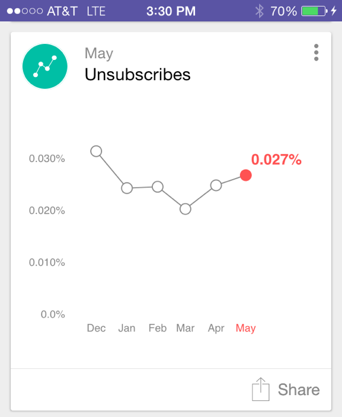

# 瞭解Analytics卡片{#understanding-analytics-cards}

在每個月初，「Marketo時刻」提供3種不同的報表卡：已獲取的銷售線索、新銷售線索和取消訂閱。 每張圖顯示您每月的績效和6個月期間的趨勢。

## Analytics卡片{#analytics-cards}

當您點選Analytics卡片時，可以：

* [讓它成為您最愛的](/help/marketo/product-docs/core-marketo-concepts/mobile-apps/marketo-moments/working-with-moments/creating-a-favorite.md)
* [標籤為完成](/help/marketo/product-docs/core-marketo-concepts/mobile-apps/marketo-moments/working-with-moments/marking-it-done.md)
* [分享](/help/marketo/product-docs/core-marketo-concepts/mobile-apps/marketo-moments/working-with-moments/sharing-a-moment.md)

點選Analytics卡片以顯示：

* 過去6個月結果的圖表
* 逐月比較
* 最多或最前三個的長條圖（視卡片而定）

例如，讓我們來看看Acquired Leads Analytics卡的詳細資料：

在此範例中，紅色表示值在所選日期範圍（嗯！）內已減少。 綠色表示值已增加(yay!)。

## 獲取的銷售線索{#acquired-leads}

**已獲取的銷售線索**&#x200B;卡顯示新銷售線索數量的逐月趨勢報告。

>[!NOTE]
>
>只有具有已定義贏取程式的銷售線索可見。

## 新銷售線索{#new-leads}

**新銷售機會**&#x200B;卡顯示您實例中過去六個月內新銷售機會總數的逐月趨勢報表。

## 取消訂閱{#unsubscribes}

**取消訂閱**&#x200B;卡片顯示您過去六個月中取消訂閱率的月相關趨勢報表。

現在你知道了。

>[!MORELIKETHIS]
>
>* [瞭解Marketo時刻](/help/marketo/product-docs/core-marketo-concepts/mobile-apps/marketo-moments/understanding-moments/understanding-marketo-moments.md)
>* [瞭解事件卡](/help/marketo/product-docs/core-marketo-concepts/mobile-apps/marketo-moments/understanding-moments/understanding-event-cards.md)
>* [瞭解電子郵件計畫卡](/help/marketo/product-docs/core-marketo-concepts/mobile-apps/marketo-moments/understanding-moments/understanding-email-program-cards.md)

