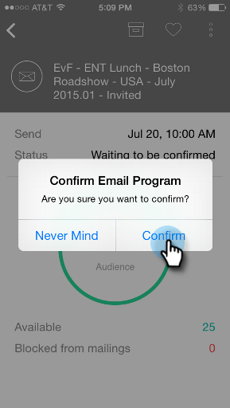

# 瞭解電子郵件計畫卡片 {#understanding-email-program-cards}

使用Marketo時刻，從您的手機或iPad檢視您的電子郵件程式。

## 以電子郵件傳送計畫卡片 {#email-program-cards}

點選任何「電子郵件計畫」卡片時，您可以：

* [將電子郵件設為我的最愛](/help/marketo/product-docs/core-marketo-concepts/mobile-apps/marketo-moments/working-with-moments/creating-a-favorite.md)
* [將電子郵件標示為完成](/help/marketo/product-docs/core-marketo-concepts/mobile-apps/marketo-moments/working-with-moments/marking-it-done.md)
* [共用電子郵件時刻卡](/help/marketo/product-docs/core-marketo-concepts/mobile-apps/marketo-moments/working-with-moments/sharing-a-moment.md)

在尚未傳送之電子郵件的電子郵件計畫卡上，您可以找到有關該電子郵件計畫狀態和受眾的資訊。

電子郵件傳送後，卡片會顯示其他寶貴資訊，包括已傳送的電子郵件數量、收件者的動作，以及促銷活動中所使用智慧清單的連結。

## 確認電子郵件卡片 {#confirming-an-email-card}

1. 若要確認未確認的電子郵件卡片，請點選三點功能表。

   

1. 點選 **確認**.

   

1. 點選 **確認** 完成工作，或 **沒關係** 如果您有其他想法。

   

   >[!NOTE]
   >
   >現在您的卡片會變成橘色！

## 取消電子郵件卡片傳送 {#canceling-an-email-card-send}

1. 如果您決定不將確認的電子郵件寄出，請點選三點功能表。

   

1. 點選 **取消傳送**.

   

## 重新排程電子郵件卡片 {#rescheduling-an-email-card}

您可以重新排程已確認或未確認的電子郵件卡片。

>[!NOTE]
>
>對於已確認的電子郵件，您必須先取消電子郵件（請參閱下文）。

1. 若要重新排程電子郵件，請點選三點功能表。

   

1. 點選 **重新排程**.

   

1. 在行事曆上選取日期，然後點選 **重新排程**.

   

   只要有無線服務，您就可以從任何地方重新排程！

## 傳送範例 {#sending-a-sample}

您可以直接與他人分享電子郵件時刻的範例。

1. 開啟「卡片」功能表。

   

1. 點選 **傳送範例**.

   

1. 輸入電子郵件地址並按一下 **傳送範例**.

   

## 預覽電子郵件 {#previewing-an-email}

以滑鼠右鍵按一下電子郵件卡片進行預覽。

1. 點選 **預覽電子郵件**.

   

   如此一來，您就可以在扣動觸發器之前知道您的電子郵件是完美無缺的！

   

   太好了！

這是檢視電子郵件行銷活動的獨家新聞。 現在，您是專業人士！

>[!MORELIKETHIS]
>
>* [瞭解Marketo時刻](/help/marketo/product-docs/core-marketo-concepts/mobile-apps/marketo-moments/understanding-moments/understanding-marketo-moments.md)
>* [瞭解事件卡](/help/marketo/product-docs/core-marketo-concepts/mobile-apps/marketo-moments/understanding-moments/understanding-event-cards.md)
>* [瞭解Analytics卡片](/help/marketo/product-docs/core-marketo-concepts/mobile-apps/marketo-moments/understanding-moments/understanding-analytics-cards.md)
