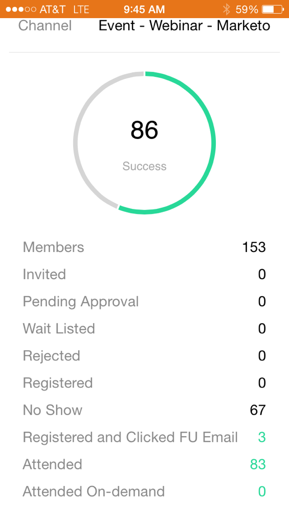

# 了解事件卡 {#understanding-event-cards}

使用Marketo時刻，在手機或iPad上查看您的活動節目。

當您點選任何「電子郵件方案」卡片時，可以：

* [將事件設為我的最愛](/help/marketo/product-docs/core-marketo-concepts/mobile-apps/marketo-moments/working-with-moments/creating-a-favorite.md)
* [將事件標示為完成](/help/marketo/product-docs/core-marketo-concepts/mobile-apps/marketo-moments/working-with-moments/marking-it-done.md)
* [共用事件時刻卡](/help/marketo/product-docs/core-marketo-concepts/mobile-apps/marketo-moments/working-with-moments/sharing-a-moment.md)

有兩張事件卡。 在活動前幾小時發送的On-Deck卡顯示註冊的人數。 之後傳送的「結果」卡片會顯示實際參加的人數。

你很好！

>[!MORELIKETHIS]
>
>* [了解Marketo時刻](/help/marketo/product-docs/core-marketo-concepts/mobile-apps/marketo-moments/understanding-moments/understanding-marketo-moments.md)
>* [了解電子郵件計畫卡](/help/marketo/product-docs/core-marketo-concepts/mobile-apps/marketo-moments/understanding-moments/understanding-email-program-cards.md)
>* [了解事件方案](/help/marketo/product-docs/demand-generation/events/understanding-events/understanding-event-programs.md)

