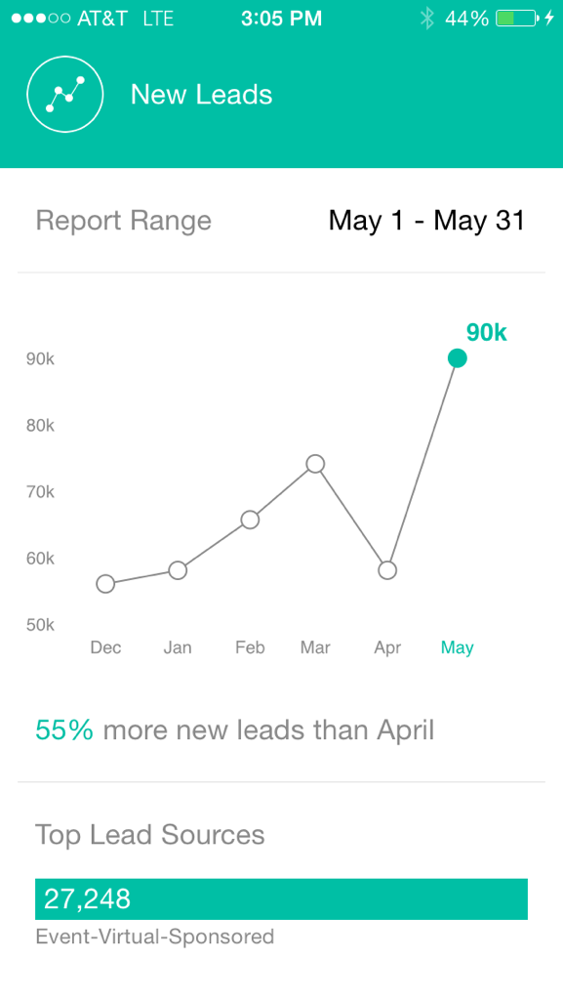

# 了解 Marketo 重要時刻 {#understanding-marketo-moments}

Marketo的強大功能已唾手可得！ 直接從您的手機或iPad預覽和重新排程電子郵件。

>[!IMPORTANT]
>
>2023年10月2日，Adobe從所有應用程式商店移除Marketo Ments App。 如果您的平板電腦/行動裝置上已安裝應用程式，目前可繼續使用。 一旦您的Marketo Engage執行個體移轉至Adobe Identity以驗證Marketo，您將無法再存取應用程式。 [了解更多](https://nation.marketo.com/t5/product-discussions/marketo-events-app-and-marketo-moments-app-end-of-life/m-p/340712/highlight/true#M193869){target="_blank"}。

>[!NOTE]
>
>_需要存取行動應用程式_&#x200B;許可權。 請連絡您的Marketo管理員以[更新您的角色](/help/marketo/product-docs/administration/users-and-roles/managing-user-roles-and-permissions.md)。

## 串流 {#streams}

以下是「時刻」中的不同串流。

>[!NOTE]
>
>**定義**
>
>* [!UICONTROL Moments]：剛才執行或即將執行的任何專案，都會移至此處。
>* [!UICONTROL Favorites]：您做成最愛的任何專案都會放在這裡。
>* [!UICONTROL Later]：在此之後發生的任何事情都會進入這裡。
>* [!UICONTROL Done]：已完成執行或您標示為完成的任何專案都會移至此處。

好了，現在我們已解決這個問題，讓我們在電話上看看Marketo時刻！

## 三種卡片 {#three-kinds-of-cards}

Marketo時刻提供您三種不同的卡片，可追蹤電子郵件的進度：

**[!UICONTROL On-Deck]** — 此電子郵件即將寄出。 這是您預覽或傳送範例，甚至於必要時取消的最後機會。

**[!UICONTROL Heart-beat]** — 嘿 — 此電子郵件正在傳遞！ 這裡也有統計資料。 繼續進行並分享。

**[!UICONTROL Results]** — 以下是電子郵件的運作方式。 電子郵件執行完畢後，「結果」卡片會顯示參與分數和其他統計資料。

## 時刻資料流 {#moments-stream}

當您第一次開啟應用程式或點選功能表中的&#x200B;**[!UICONTROL Moments]**&#x200B;時，會先顯示相關卡片。 每一個都包含特定行銷計畫及其整體績效的相關資訊。

點選卡片會開啟詳細資訊畫面。

>[!NOTE]
>
>橘色卡片已確認；灰色卡片已暫定。

點選三個點會開啟卡片動作選單。

太棒了！ 現在，您可以點選以下專案來讓事情發生：

>[!NOTE]
>
>**定義**
>
>* [!UICONTROL Favorite]：如果您將內容設成我的最愛，可以輕鬆注意到最及時且最重要的內容。
>* [!UICONTROL Done]：「完成」可讓您從Marketo的「時刻」檢視中移除(但保留在Marketo中，安全無虞)。
>* [!UICONTROL Share]：傳送影像以激勵或祝賀您的團隊。
>* [!UICONTROL Send Sample] （僅限電子郵件）：使用此功能讓其他人檢視您的電子郵件在您傳送出去之前的面貌。
>* [!UICONTROL Preview Email] （僅限電子郵件）：最好是預先取出您的電子郵件。

## 後續時刻 {#later-moments}

「稍後」區段顯示即將推出的活動。

1. 點選漢堡選單。

   

1. 點選&#x200B;**[!UICONTROL Later]**。

   

   檢視近期活動清單。

   

## 以電子郵件傳送計畫卡片 {#email-program-cards}

電子郵件方案卡會顯示重要資訊，例如排程、對象、狀態和其他有用專案，即使您午餐在外也一樣。

## 活動卡片 {#event-cards}

若是事件，您會看到成員總數及其狀態。

## Analytics卡 {#analytics-cards}

Analytics時刻卡片會向您顯示過去六個月每月電子郵件和事件的執行方式，例如：

1. 已取得的銷售機會
1. 新銷售機會
1. 取消訂閱

## 智慧行銷活動執行卡 {#smart-campaign-run-cards}

智慧行銷活動卡代表行銷活動的單一回合。 每次執行智慧行銷活動時，都會顯示新卡片。 點選以檢視使用的智慧清單篩選器、行銷活動流量，以及行銷活動中使用的每個電子郵件。

## 確認或取消動作 {#confirm-or-cancel-an-action}

在此過程中的每個步驟，您都可以確認或取消動作。 如果您改變心意，只要點選&#x200B;**[!UICONTROL Never Mind]**。

## 支援的版本 {#supported-versions}

Marketo Moments支援下列作業系統版本：

* [!DNL Apple] iOS 8.0和更新版本。
* [!DNL Android] 4.1版和更新版本（基本上是Jellybean和更新版本）。

準備好了解更多？

>[!MORELIKETHIS]
>
>* [瞭解電子郵件程式卡](/help/marketo/product-docs/core-marketo-concepts/mobile-apps/marketo-moments/understanding-moments/understanding-email-program-cards.md)
>* [瞭解活動卡](/help/marketo/product-docs/core-marketo-concepts/mobile-apps/marketo-moments/understanding-moments/understanding-event-cards.md)
>* [瞭解Analytics卡](/help/marketo/product-docs/core-marketo-concepts/mobile-apps/marketo-moments/understanding-moments/understanding-analytics-cards.md)
>* [瞭解智慧行銷活動資訊卡](/help/marketo/product-docs/core-marketo-concepts/mobile-apps/marketo-moments/understanding-moments/understanding-smart-campaign-cards.md)
