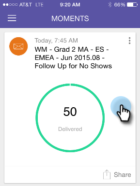

# 瞭解Marketo時刻{#understanding-marketo-moments}

Marketo的力量現在掌握在你手中！ 直接從您的手機或iPad預覽並重新排程電子郵件。

>[!AVAILABILITY]
>
>
>必須擁有「存取行動應用程式」權限。 請連絡您的Marketo管理員以[更新您的角色](/help/marketo/product-docs/administration/users-and-roles/managing-user-roles-and-permissions.md)。

## 串流{#streams}

以下是「瞬間」中的不同串流。

>[!NOTE]
>
>**定義**
>
>* 瞬間：任何剛剛跑過或即將跑過的東西都會跑到這裡。
>* 我的最愛：你最愛的東西都在這裡。
>* 稍後：比這時晚發生的一切都在這裡。
>* 完成：任何已完成執行或您標示為完成的項目，都會在這裡進行。

好了，既然我們已經有辦法了，讓我們在電話上一窺Marketo時刻！

## 三種卡{#three-kinds-of-cards}

Marketo時刻會提供三張不同的卡片，以追蹤您電子郵件的進度：

**On-Deck** -這封電子郵件即將推出。這是您預覽、傳送範例，甚至視需要取消範例的最後機會。

**心跳** -嘿——這封電子郵件正在傳送！這裡還有統計資料。 繼續分享。

**結果** -電子郵件的運作方式如下。執行完電子郵件後，「結果」卡片會顯示參與分數和其他統計資料。

## 矩數串流{#moments-stream}

當您第一次開啟應用程式或在功能表中點選&#x200B;**Monts**&#x200B;時，相關卡片會先顯示。 每個項目都包含該特定行銷計畫及其整體績效的相關資訊。

點選資訊卡會開啟詳細畫面。

>[!NOTE]
>
>橙色卡已確認；灰色的則是試探性的。

點選三個點會開啟卡片動作選單。

太好了！ 現在，您可以點選：

>[!NOTE]
>
>**定義**
>
>* 我的最愛：如果您讓客戶最愛，就可輕鬆地關注最及時、最重要的內容。
>* 完成：Done讓您從Marketo時刻(Monts)的檢視中獲得它(但讓它保留在Marketo，安全無虞)。
>* 分享：傳送影像以激勵或祝賀您的團隊。
>* 傳送範例（僅限電子郵件）:在您寄出電子郵件之前，請讓其他人查看您的電子郵件外觀。
>* 預覽電子郵件（僅限電子郵件）:提前查看您的電子郵件總是個好主意。

## 後續時刻{#later-moments}

「稍後」區段顯示近期活動。

1. 首先點選漢堡包選單。

   

1. 點選&#x200B;**Later**。

   

   檢視近期活動的清單。

   

## 電子郵件程式卡{#email-program-cards}

電子郵件節目卡會顯示重要內容，例如排程、觀眾、狀態和其他有用的項目，即使您在午餐時外出。

## 事件卡{#event-cards}

若是事件，您會看到成員總數及其狀態。

## Analytics卡片{#analytics-cards}

Analytics時刻卡片可顯示過去6個月電子郵件和事件的月繳型績效：

1. 獲得的銷售線索
1. 新銷售線索
1. 取消訂閱

## 智慧型促銷活動執行卡{#smart-campaign-run-cards}

智慧型促銷活動資訊卡代表單一促銷活動執行。 每次智慧型促銷活動執行時，都會顯示新的卡片。 點選可查看使用的智慧型清單篩選、促銷活動流程，以及促銷活動中使用的每封電子郵件。

## 確認或取消動作{#confirm-or-cancel-an-action}

在每個步驟中，您都可以確認或取消動作。 如果您改變主意，只要點選&#x200B;**Never Mind**&#x200B;即可。

## 支援的版本{#supported-versions}

Marketo時刻支援以下作業系統版本：

* Apple iOS 8.0和更新版本。
* Android 4.1版及更新版本（基本上是Jellybean和更新版本）。

準備好要進一步瞭解嗎？

>[!MORELIKETHIS]
>
>* [瞭解電子郵件計畫卡](/help/marketo/product-docs/core-marketo-concepts/mobile-apps/marketo-moments/understanding-moments/understanding-email-program-cards.md)
>* [瞭解事件卡](/help/marketo/product-docs/core-marketo-concepts/mobile-apps/marketo-moments/understanding-moments/understanding-event-cards.md)
>* [瞭解Analytics卡片](/help/marketo/product-docs/core-marketo-concepts/mobile-apps/marketo-moments/understanding-moments/understanding-analytics-cards.md)
>* [瞭解智慧型促銷活動資訊卡](/help/marketo/product-docs/core-marketo-concepts/mobile-apps/marketo-moments/understanding-moments/understanding-smart-campaign-cards.md)

