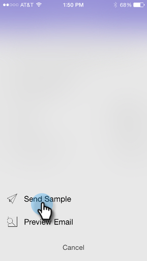

# 瞭解Smart Campaign資訊卡 {#understanding-smart-campaign-cards}

使用Marketo Ments從您的智慧型手機或iPad檢視您的每輪智慧型行銷活動。 Marketo Moments智慧行銷活動卡表示行銷活動的單次執行；每次智慧行銷活動執行時都會顯示新卡。 智慧行銷活動卡在左上角標有燈泡。

對於已排程但尚未執行的未來智慧行銷活動， Marketo時刻卡尚未顯示任何行銷活動統計資料。 它們將顯示在未來的版本中。

## 智慧行銷活動資訊卡 {#smart-campaign-cards}

1. 點選卡片以開啟詳細資訊卡。

   

1. 詳細資訊卡可讓您存取智慧清單篩選器、流量和電子郵件摘要的相關資訊。

1. 點選 **智慧清單**.

   

1. 此處顯示智慧清單使用的濾鏡。

   

1. 點選 **流量**.

   

1. 現在您會看到Smart Campaign的流程。 此行銷活動只有一個流程步驟，但可以有多個步驟。

   

1. 按一下 **電子郵件摘要**.

   

1. 現在，您可以依數字和百分比，檢視每封電子郵件的收件者回應。

   

1. 看到底部的兩個點了嗎？ 它們表示有兩個電子郵件連結至此智慧行銷活動。 若要檢視其他電子郵件的結果，請將畫面向左撥動。 以下是第二封電子郵件的結果。

   

   >[!NOTE]
   >
   >請注意，現在已反白顯示另一個點。

## 建立電子郵件範例和預覽 {#creating-email-samples-and-previews}

在電子郵件傳出之前先檢視電子郵件是個好主意。 或者，將樣本傳送給其他人，以取得第二組眼睛。

1. 點選電子郵件上的三個點動作選單。

   

1. 點選 [傳送範例](/help/marketo/product-docs/core-marketo-concepts/mobile-apps/marketo-moments/working-with-moments/sending-a-sample.md) 或 [預覽電子郵件](/help/marketo/product-docs/core-marketo-concepts/mobile-apps/marketo-moments/working-with-moments/previewing-an-email.md) （如需詳細資訊，請按一下這些連結）。

   

## 確認智慧型行銷活動執行 {#confirming-a-smart-campaign-run}

未確認的智慧行銷活動的卡片會變成灰色，直到您確認為止。 然後，它們會變成橙色。

1. 若要確認未確認的智慧行銷活動資訊卡，請點選三點動作功能表。

   

1. 點選 **確認**.

   

1. 點選 **確認** 完成工作，或 **沒關係** 如果您有其他想法。

   

   >[!NOTE]
   >
   >現在您的卡片會變成橘色！

## 取消Smart Campaign執行 {#canceling-a-smart-campaign-run}

您可以取消已確認、已排程的智慧型行銷活動執行。

1. 點選三點動作選單。

   

1. 點選 **取消執行**.

   

1. 點選 **取消執行**. 如果您在最後一分鐘決定不取消執行，請點選 **沒關係**，而smart campaign會依排程執行。

   

## 重新排程智慧行銷活動 {#rescheduling-a-smart-campaign}

您可以重新排程尚未執行的已確認智慧型行銷活動。

1. 點選三點動作選單。

   

1. 點選 **重新排程**.

   

1. 在行事曆上選取日期，然後點選 **重新排程**.

   

   蛋糕！

## 其他Smart Campaign動作 {#other-smart-campaign-actions}

和其他Marketo「時刻」卡片一樣，您可以點選任何Smart Campaign卡片或詳細資訊卡上的三個點，以便：

* [使其成為我的最愛](/help/marketo/product-docs/core-marketo-concepts/mobile-apps/marketo-moments/working-with-moments/creating-a-favorite.md)
* [將其標籤為完成](/help/marketo/product-docs/core-marketo-concepts/mobile-apps/marketo-moments/working-with-moments/marking-it-done.md)
* [共用](/help/marketo/product-docs/core-marketo-concepts/mobile-apps/marketo-moments/working-with-moments/sharing-a-moment.md)

>[!NOTE]
>
>您也可以點選 **共用** 圖示加以共用，以及 **完成** 和 **我的最愛** 詳細資訊卡上的圖示。

## 快速刪除智慧行銷活動資訊卡 {#quickly-delete-a-smart-campaign-card}

如果您有不再需要的卡片，可能是用於測試的卡片，您可以向左或向右快速撥動以將其移除。
