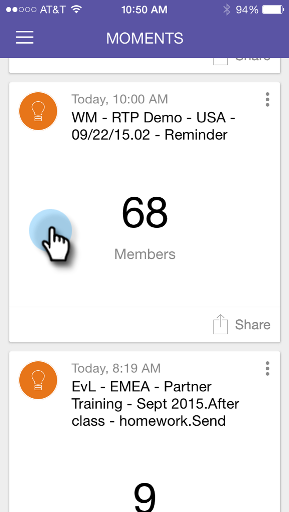

# 瞭解智慧型促銷活動資訊卡{#understanding-smart-campaign-cards}

使用「Marketo時刻」，從智慧型手機或iPad檢視您每次智慧型宣傳活動。 「Marketo時刻」智慧型宣傳卡代表單次宣傳；每次智慧型促銷活動執行時，都會顯示新卡片。 智慧型宣傳卡在左上角標有燈泡。

對於已排程但尚未執行的未來智慧型促銷活動，「Marketo時刻」卡尚未顯示任何促銷活動統計資料。 它們會出現在未來的版本中。

## 智慧型促銷活動資訊卡{#smart-campaign-cards}

1. 點選資訊卡以開啟詳細資訊卡。

   

1. 詳細資訊卡可讓您存取智慧型清單篩選器、流量和電子郵件摘要的相關資訊。

1. 點選&#x200B;**智慧型清單**。

   

1. 智慧型清單所使用的篩選器如下所示。

   

1. 點選&#x200B;**Flow**。

   

1. 現在，您將看到智慧型促銷活動的流程。 此促銷活動只有一個流程步驟，但可以有多個流程步驟。

   

1. 按一下&#x200B;**電子郵件摘要**。

   

1. 現在，您可以依數量和百分比查看每個電子郵件的收件者回應。

   

1. 看見底部那兩個點了嗎？ 他們指出，有兩封電子郵件與此智慧型宣傳連結。 若要檢視其他電子郵件的結果，請向左滑動畫面。 以下是第二封電子郵件的結果。

   

   >[!NOTE]
   >
   >請注意，現在會反白顯示另一個點。

## 建立電子郵件範例和預覽{#creating-email-samples-and-previews}

在電子郵件發佈之前先查看一下，這是個好主意。 或者，將樣本傳送給其他人，讓他人再看一眼。

1. 點選電子郵件上的三點動作功能表。

   

1. 點選[傳送範例](/help/marketo/product-docs/core-marketo-concepts/mobile-apps/marketo-moments/working-with-moments/sending-a-sample.md)或[預覽電子郵件](/help/marketo/product-docs/core-marketo-concepts/mobile-apps/marketo-moments/working-with-moments/previewing-an-email.md)（如需詳細資訊，請按一下這些連結）。

   

## 確認智慧型促銷活動執行{#confirming-a-smart-campaign-run}

未確認智慧型促銷活動的資訊卡會變成灰色，直到您確認為止。 然後，它們變成橘黃色。

1. 若要確認未確認的智慧型促銷活動資訊卡，請點選三個點動作選單。

   

1. 點選&#x200B;**確認**。

   

1. 點選&#x200B;**確認**&#x200B;以完成工作，或點選&#x200B;**Never Mind**（如果您有其他想法）。

   

   >[!NOTE]
   >
   >現在你的卡會變成橘色了！

## 取消智慧型促銷活動執行{#canceling-a-smart-campaign-run}

您可以取消已確認的已排程智慧型促銷活動執行。

1. 點選三點動作選單。

   

1. 點選&#x200B;**取消執行**。

   

1. 點選&#x200B;**取消執行**。 如果您在最後一刻決定不取消執行，請點選&#x200B;**Never Mind**，智慧型促銷活動就會如已排程般執行。

   

## 重新計畫智慧促銷活動{#rescheduling-a-smart-campaign}

您可以重新計畫尚未執行的已確認智慧型促銷活動。

1. 點選三點動作選單。

   

1. 點選&#x200B;**重新計畫**。

   

1. 在日曆上選擇日期，然後點選&#x200B;**重新計畫**。

   

   小菜一碟！

## 其他智慧型促銷活動動作{#other-smart-campaign-actions}

和其他Marketo時刻卡一樣，您可以點選任何Smart Campaign卡片或詳細資料卡上的三個點，以：

* [讓它成為您最愛的](/help/marketo/product-docs/core-marketo-concepts/mobile-apps/marketo-moments/working-with-moments/creating-a-favorite.md)
* [完成標籤](/help/marketo/product-docs/core-marketo-concepts/mobile-apps/marketo-moments/working-with-moments/marking-it-done.md)
* [分享](/help/marketo/product-docs/core-marketo-concepts/mobile-apps/marketo-moments/working-with-moments/sharing-a-moment.md)

>[!NOTE]
>
>您也可以點選「智慧型促銷活動」資訊卡上的&#x200B;**共用**&#x200B;圖示，以及詳細資訊卡上的&#x200B;**完成**&#x200B;和&#x200B;**最愛**&#x200B;圖示。

## 快速刪除智慧型促銷活動資訊卡{#quickly-delete-a-smart-campaign-card}

如果您不再需要的資訊卡（也許是測試用的資訊卡），您可以快速向左或向右滑動來移除。
