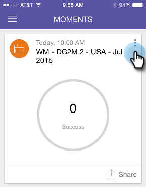

# 將其標籤為完成 {#marking-it-done}

將電子郵件程式、事件或分析卡片標示為「完成」，將其從串流中移除。 有兩種方法可以做到這一點。

1. 點選動作功能表。

   

1. 點選 **完成**.

   

1. 或者，以任一方式撥動卡片。

   

   >[!NOTE]
   >
   >將卡片標示為「完成」並不會刪除電子郵件、事件或智慧行銷活動。 它只會將其從「時刻/稍後」資料流移至「完成」資料流。

蛋糕！
