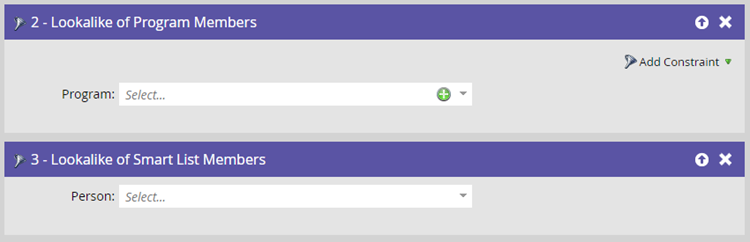

# 預測篩選器 {#predictive-filters}

作為預測受眾的一部分，Marketo在智慧市場活動中的智慧清單中提供一組基於人工智慧/機器學習的過濾器。

>[!NOTE]
>
>「可能會出席」和「可能會註冊」篩選器只能用於事件或電子郵件程式。 「取消訂閱的可能性」、「程式成員的長相相似」和「智慧清單成員的長相相似」可用於所有程式類型。

## 參加的可能性

此篩選器用於有效地縮小您的受眾範圍。 這有助於您確定目標並邀請具有較高可能性的潛在客戶 **出席** 網路研討會或活動。 請注意，您的「參加計畫的可能性」將是您當前的活動計畫。

## 註冊的可能性

與 _參加的可能性_ 篩選，使用此篩選可縮小受眾和目標潛在客戶的範圍，這些潛在客戶的可能性更高 **註冊** 網路研討會或活動。

## 取消訂閱的可能性

這通過觀眾在未來兩週內取消訂閱的可能性是否高或低來過濾觀眾。 您可以使用它來以不同和更有效的方式瞄準高疲勞引線。 取消訂閱閾值是動態的，由考慮多個屬性的AI模型驅動，包括資料庫中的提前期和潛在顧客活動。

>[!NOTE]
>
>「出席/註冊/取消訂閱的可能性」過濾器必須與其他標準過濾器一起使用。

## 程式成員的相似性/智慧清單成員的相似性

這兩個篩選器通過瞄準與其他程式或智慧清單成員相似的其他線索來幫助您擴展當前受眾。 Looklay過濾器考慮50多個因素，包括潛在顧客屬性、電子郵件活動、Web活動和項目。

按一下 **[!UICONTROL 添加約束]** 為選定程式的成員選擇成功標準。

按一下 **+** 表徵圖可輕鬆將多個程式/智慧清單添加到一個篩選器中。

