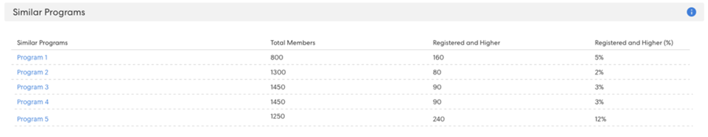
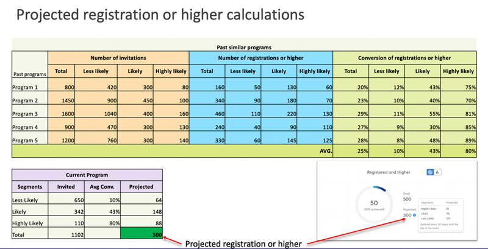

# 瞭解目標追蹤和預計註冊 {#understanding-goal-tracking-and-projected-registrations}

以下說明如何追蹤目標進度並瞭解Marketo的預測。

>[!PREREQUISITES]
>
>若要存取這些功能中的大部分，請務必啟用 [新一代切換](/help/marketo/product-docs/marketo-engage-modern-ux/toggle-switch.md){target="_blank"} 用於活動計畫。

>[!NOTE]
>
>在Marketo Classic體驗中建立事件計畫時，事件開始日期目前預設為事件建立日期。 由於預計註冊會考量在事件開始日期之前經過的時間量，因此如果開始日期和建立日期相同（除非有刻意設定），這些數字可能並不準確。

## 目標追蹤和專案註冊

1. 您可在以下連結中找到目標追蹤詳細資訊： **[!UICONTROL 報表]** 標籤進行識別。 在此特定範例中，目前有150名註冊會員，而目標為200名(75%)。

   

您也會看到您的 **[!UICONTROL 預計]** 註冊。 將游標停留在資訊圖示上，即可檢視此數字依可能性區段的劃分資訊。

>[!NOTE]
>
>「已參加」和「較高」圖表將保持空白，直到活動日為止。

如果您尚未啟用切換開關，以下是其在Marketo類別UI中的顯示方式：

1. 按一下「圖表」切換按鈕，即可切換為依註冊可能性來劃分成員。 您將看到每個區段目前的註冊百分比，並與過去計畫中該區段的平均百分比相比較。

   

所有成員（已註冊和未註冊）都會根據其註冊可能性進行分類。 將游標停留在資訊圖示上，以檢視這些可能性類別的定義方式。

>[!NOTE]
>
>預測數字每24小時更新一次，直到事件當天為止。 任何成員列為 _處理中_ 將被包含在下一個計算週期中。

## 類似的計畫

您可以檢視類似計畫在過去的執行方式，深入瞭解您目前的事件。 此段落顯示過去6個月內最多5個類似的計畫，以及曾經參與計畫的成員人數/百分比 _已註冊_ 或更高。

在計算類似程式時，我們特別包含下列因素：

* 計畫型別
* 計畫頻道
* 對象規模
* 程式標籤
* 從事件建立到事件開始的時間
* 事件持續時間

  

## 建議

在「報表」頁面頂端，您可以根據進度找到AI/ML驅動的建議。 請定期回來檢視實用提示和見解！

## 個人層級預測

按一下 **[!UICONTROL 成員]** 標籤以檢視您的所有計畫成員。 將游標暫留在 **[!UICONTROL 註冊可能性]** 或 **[!UICONTROL 出席可能性]** 橫條圖，以瞭解確切的百分比和分類。 然後，您可以對特定類別中的成員採取行動（例如，「不太可能」註冊類別中的每個人），並明確鎖定他們以潛在地增加您的註冊編號。

>[!NOTE]
>
>個人可能性會考慮40多種個人因素，包括個人檔案屬性、個人活動，以及過去受邀/註冊/參與的活動。

## 常見問題集

**問：什麼是區段？**

A：可能登入的是從0到100的值。 每個活動方案會員都可得到0-100之間的似然值。

我們將可能性值放入三個區段：

* 註冊的可能性>50% =極有可能的區段
* 註冊的可能性大於25%至&lt;50% =可能的區段
* 註冊的可能性&lt;25% =可能性較低的區段

當個人獲得註冊的可能性時，預測將屬於這些區段之一（每個計畫成員都將屬於其中一個）。 例如，如果根據可能性預測某個活動方案有1000名成員，則這1000名成員將被分發到 _極有可能_， _有可能_，或 _不太可能_ 區段。

因此，屬於「極有可能」區段的人將更有可能註冊此事件。

註冊轉換=已註冊區段中的人數除以屬於該區段的人數（例如，如果100人屬於高可能性區段，且其中60人註冊，則轉換率為60%）。

要註冊的轉換%將遵循以下模式：高可能性>可能性>低可能性。

**問：如何使用深入分析？**

答：最佳實務包含下列內容：

i.您建立方案，然後Smart Campaign使用「大於X」的預測性篩選器，這會導致特定數量的人員（假設1000），而您執行行銷活動。

二、 24小時後，在 [!UICONTROL 報表] 索引標籤您可以看到根據註冊目前受邀之所有人員之值的可能性計算出的預計註冊。

iii. 如果預計註冊次數少於目標，您必須邀請更多人員。 此時，您可以檢視相關深入分析，瞭解過去程式中可使用的臨界值。

iv. 您可以使用此臨界值建立新的Smart Campaign，以邀請更多人員。

v.在任何時間點，如果您想要瞭解顯示預計數字的原因，可以切換以檢視跨區段的對象分佈、其來自過去的轉換率，並將這些轉換率套用至目前的對象（請參閱下面的熒幕擷圖）。

**問：按註冊區段圖表代表什麼？**

答：三個長條圖，每個長條圖代表一個區段（可能性高、可能性高、可能性低）。

**紫色虛線：** 在該區段中註冊的平均交談率（根據過去的類似計畫）。

**藍色列：** 該區段中所有人員的註冊百分比。

例如，假設在這100名註冊者中，有100人可能註冊> 50%，60人可能註冊。 很可能有60%的轉換。 因此，所有新增至計畫的會員都有可能註冊值，然後這些值會放入區段中，並根據每個區段中註冊的人數計算轉換率。

**問：「已註冊及以上」代表什麼意思？**

答：任何列為已註冊的人員，或具有相等或較高步驟編號的任何其他狀態。

您可以為事件程式建立新的進度狀態，但我們會將這些狀態與標準狀態對應。 考慮將某人從受邀者移至提醒者的情況，此步驟比註冊更高。 此人員也將被視為已註冊，並顯示在目標追蹤中。

**問：如何計算預計註冊？**

答：請參閱下文。

