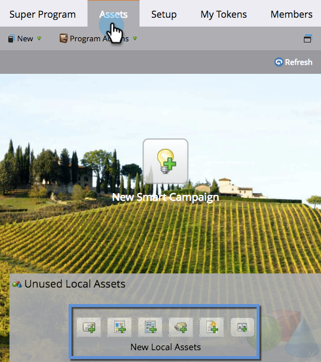

# 使用資產索引標籤 {#using-the-assets-tab}

資產畫布是預設或事件程式的視覺化表示法。 您可以使用它來新增本機資產，以及與現有資產互動。

## 新增Assets {#adding-assets}

按一下所需程式中的&#x200B;**[!UICONTROL Assets]**&#x200B;索引標籤。 選擇下列任何資產，並將其新增至您的程式。

## 管理您的程式  {#manage-your-program}

當您的程式中有資產時，您會在此處看到這些資產。

| 橙色 | 觸發程序行銷活動 |
|---|---|
| 綠色 | 批次行銷活動 |

如果您想要與該資產互動，可以在標題上按一下右鍵。

>[!TIP]
>
>拖放以重新排列資產欄。

不屬於您程式本機的Assets看起來會像這樣：

資產索引標籤是一個很棒的小儀表板，用於程式內和程式中參照的所有內容。
