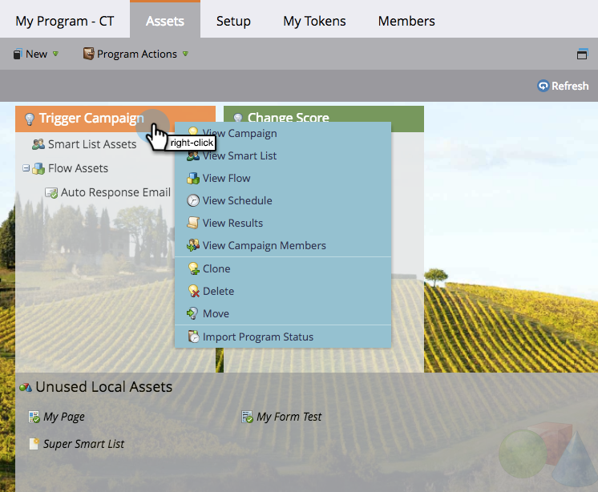

# 使用資產標籤{#using-the-assets-tab}

資產畫布是程式的視覺呈現。 您可以使用它新增本機資產，並與現有資產互動。

## 新增資產{#adding-assets}

從&#x200B;**行銷活動**&#x200B;區域，按一下&#x200B;**資產**&#x200B;標籤。 選擇下列任一資產，並將其新增至您的計畫。

## 管理您的程式{#manage-your-program}

當您的程式中有資產時，您會看到這些資產列在此處。

| 橙色 | 觸發促銷活動 |
|---|---|
| 綠色 | 批次促銷活動 |

如果您想要與該資產互動，可以在頁首上按一下滑鼠右鍵。

>[!TIP]
>
>拖放以重新排列資產欄。

非本端至您方案的資產如下所示：

「資產」標籤是程式中所有內容和參考的絕佳小型儀表板。
