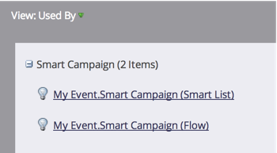

# 使用方案首頁標籤 {#using-the-program-home-tab}

計畫首頁索引標籤為您提供計畫進展情況的概觀。

## 摘要檢視 {#summary-view}

1. 前往 **行銷活動**.

   

1. 選取方案。

   

   >[!NOTE]
   >
   >這是您的預設檢視。 它提供有關您的設定、排程、結果和成員計畫狀態的資訊。

1. 按一下加底線的元素以進行變更或檢視更多資訊。

   

1. 按一下 **匯出** 位於要下載的摘要報告底部。

   

## 由檢視使用 {#used-by-view}

1. 在行銷活動中，選取方案。

   

1. 按一下 **檢視** 下拉式清單。 選取 **使用者**.

   

   此檢視顯示正在使用哪些智慧型行銷活動。

   

## 成員資格檢視 {#membership-view}

1. 在行銷活動中，選取方案。

   

1. 按一下 **檢視** 下拉式清單。 選取 **會籍**.

   

   這會向您顯示成員在方案狀態中移動時的位置圖表。

   

   >[!NOTE]
   >
   >**歷史** 表示曾瀏覽過此計畫的使用者，同時 **目前** 僅包含目前方案中的人員。

   >[!MORELIKETHIS]
   >
   >[瞭解計畫成員資格](/help/marketo/product-docs/core-marketo-concepts/programs/creating-programs/understanding-program-membership.md)
