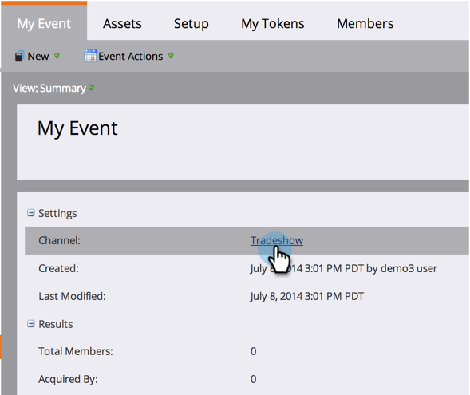

# 使用方案首頁頁簽 {#using-the-program-home-tab}

方案首頁標籤可讓您以高階方式查看方案中的進行情況。

## 摘要檢視 {#summary-view}

1. 前往 **行銷活動**.

   

1. 選擇方案。

   

   >[!NOTE]
   >
   >這是您的預設檢視。 它提供了有關設定、計畫、結果和成員程式狀態的資訊。

1. 按一下帶底線的元素以進行變更或檢視詳細資訊。

   

1. 按一下 **匯出** 在「摘要」底部以下載報表。

   

## 供檢視使用 {#used-by-view}

1. 在行銷活動中，選取方案。

   

1. 按一下 **檢視** 下拉式清單。 選擇 **使用者**.

   

   此檢視會顯示正在使用的智慧型促銷活動。

   

## 成員資格視圖 {#membership-view}

1. 在行銷活動中，選取方案。

   

1. 按一下 **檢視** 下拉式清單。 選擇 **會籍**.

   

   這顯示了成員在程式狀態中移動時的位置圖。

   

   >[!NOTE]
   >
   >**歷史** 表示有人參加過這個計畫， **目前** 僅包括當前程式中的人員。

   >[!MORELIKETHIS]
   >
   >[了解方案會籍](/help/marketo/product-docs/core-marketo-concepts/programs/creating-programs/understanding-program-membership.md)
