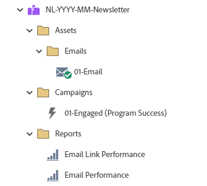

# NL-YYYY-MM-Newsletter {#nl-yyyy-mm-newsletter}

此範例利用Marketo Engage電子郵件計畫傳送一封電子報電子郵件。 電子郵件可以包含或不包含A/B測試。

如需進一步的策略協助或自訂方案的協助，請連絡Adobe客戶團隊或造訪[Adobe Professional Services](https://business.adobe.com/customers/consulting-services/main.html){target="_blank"}頁面。

## 頻道摘要 {#channel-summary}

<table style="table-layout:auto"> 
 <tbody> 
  <tr> 
   <th>管道</th> 
   <th>成員資格狀態</th>
   <th>Analytics行為</th>
   <th>計畫型別</th>
  </tr> 
  <tr> 
   <td>電子報</td> 
   <td>01位成員 
 02 — 參與 — 成功</td>
   <td>包含</td>
   <td>電子郵件</td>
  </tr>
 </tbody> 
</table>

## 程式包含下列Assets {#program-contains-the-following-assets}

<table style="table-layout:auto"> 
 <tbody> 
  <tr> 
   <th>類型</th> 
   <th>範本名稱</th>
   <th>資產名稱</th>
  </tr> 
  <tr> 
   <td>電子郵件</td> 
   <td><a href="/help/marketo/product-docs/core-marketo-concepts/programs/program-library/quick-start-email-template.md" target="_blank">快速入門電子郵件範本</a></td>
   <td>01 — 電子郵件</td>
  </tr>
  <tr> 
   <td>本地報告</td> 
   <td> </td>
   <td>電子郵件效能</td>
  </tr>
  <tr> 
   <td>本地報告</td> 
   <td> </td>
   <td>電子郵件連結效能</td>
  </tr>
  <tr>
  <tr> 
   <td>Smart Campaign</td> 
   <td> </td>
   <td>01 — 參與（計畫成功）</td>
  </tr>
  <tr> 
   <td>資料夾</td> 
   <td> </td>
   <td>Assets — 容納所有創意資產 
 （電子郵件的子資料夾）  </td>
  </tr>
  <tr> 
   <td>資料夾</td> 
   <td> </td>
   <td>行銷活動 — 容納所有智慧行銷活動</td>
  </tr>
  <tr> 
   <td>資料夾</td> 
   <td> </td>
   <td>報表</td>
  </tr>
 </tbody> 
</table>

## 包含我的Token {#my-tokens-included}

<table style="table-layout:auto"> 
 <tbody> 
  <tr> 
   <th>權杖型別</th> 
   <th>Token名稱</th>
   <th>值</th>
  </tr>
  <tr> 
   <td>文字</td> 
   <td><code>{{my.Email-FromAddress}}</code></td>
   <td>PlaceholderFrom.email@mydomain.com</td>
  </tr>
  <tr> 
   <td>文字</td> 
   <td><code>{{my.Email-FromName}}</code></td>
   <td><code><--My From Name Here--></code></td>
  </tr>
  <tr> 
   <td>文字</td> 
   <td><code>{{my.Email-ReplyToAddress}}</code></td>
   <td>reply-to.email@mydomain.com</td>
  </tr>
 </tbody> 
</table>

## 衝突規則 {#conflict-rules}

* **程式標籤**
   * 在此訂閱中建立標籤 — _建議_
   * 忽略

* **名稱相同的登入頁面範本**
   * 複製原始範本
   * 使用目的地範本 — _建議_

* **相同名稱的影像**
   * 保留兩個檔案
   * 取代此訂閱中的專案 — _建議_

* **相同名稱的電子郵件範本**
   * 保留兩個範本
   * 取代現有的範本 — _建議_

## 最佳實務 {#best-practices}

* 請考慮更新您匯入的程式中的範本，以使用目前品牌的範本，或更新新匯入的範本，以透過新增程式碼片段或適當的標誌/頁尾資訊來反映您的品牌。

* 請考慮更新此程式範例的命名慣例，以符合您的命名慣例。

>[!NOTE]
>
>請記得在程式範本上更新「我的Token值」，並且每次您視需要使用程式時都進行更新。

>[!TIP]
>
>別忘了啟動「01參與」行銷活動以追蹤成功！ _before_&#x200B;請執行此動作。您的表單已上線且已傳送電子郵件。
