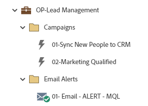

# OP-商機管理 {#op-lead-management}

這是銷售機會管理最佳實務工作流程的範例，利用Marketo Engage預設程式協助您管理Marketo Engage資料庫內傳送給CRM的記錄。

>[!NOTE]
>
>在Marketo Engage中，資料庫中的記錄稱為人員/人員。 此範例中的潛在客戶管理會參照您CRM中的記錄。

如需進一步的策略協助或自訂方案的協助，請連絡Adobe客戶團隊或造訪[Adobe Professional Services](https://business.adobe.com/customers/consulting-services/main.html)頁面。

## 頻道摘要 {#channel-summary}

<table style="table-layout:auto">
 <tbody>
  <tr>
   <th>管道</th>
   <th>成員資格狀態</th>
   <th>Analytics行為</th>
   <th>計畫型別</th>
  </tr>
  <tr>
   <td>營運</td>
   <td>01位成員</td>
   <td>營運</td>
   <td>預設</td>
  </tr>
 </tbody>
</table>

## 程式包含下列Assets {#program-contains-the-following-assets}

<table style="table-layout:auto">
 <tbody>
  <tr>
   <th>類型</th>
   <th>範本名稱</th>
   <th>資產名稱</th>
  </tr>
  <tr>
   <td>智慧行銷活動</td>
   <td> </td>
   <td>01 — 將新使用者同步至CRM</td>
  </tr>
  <tr>
   <td>智慧行銷活動</td>
   <td> </td>
   <td>02 — 符合行銷資格</td>
  </tr>
  <tr>
   <td>電子郵件</td>
   <td><a href="/help/marketo/product-docs/core-marketo-concepts/programs/program-library/quick-start-email-template.md" target="_blank">快速開始電子郵件範本</a></td>
   <td>01 — 電子郵件 — 警報 — MQL</td>
  </tr>
  <tr>
   <td>資料夾</td>
   <td> </td>
   <td>行銷活動</td>
  </tr>
  <tr>
   <td>資料夾</td>
   <td> </td>
   <td>電子郵件警示</td>
  </tr>
 </tbody>
</table>

## 衝突規則 {#conflict-rules}

* **程式標籤**
   * 在此訂閱中建立標籤 — _建議_
   * 忽略

* **名稱相同的登入頁面範本**
   * 複製原始範本 — _建議_
   * 使用目的地範本

* **相同名稱的影像**
   * 保留兩個檔案 — _建議_
   * 取代此訂閱中的專案

* **相同名稱的電子郵件範本**
   * 保留兩個範本 — _建議_
   * 取代現有範本

## 最佳做法 {#best-practices}

* 請考慮新增其他Smart Campaigns，以滿足您可能在組織中追蹤的每個生命週期狀態需求。 此方案中建置的每個行銷活動都是最佳實務建置的範例，而非所有使用案例所特有的。 請記得更新Smart Campaigns，以解決您特定的潛在客戶生命週期管理程式。

* 請考慮更新此程式範例的命名慣例，以符合您的命名慣例。
